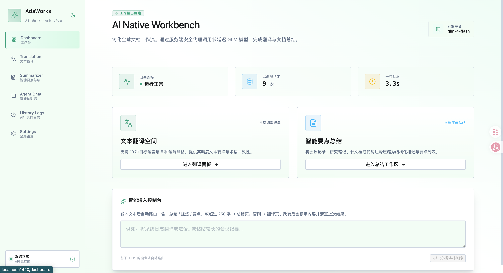
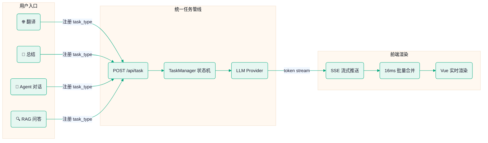
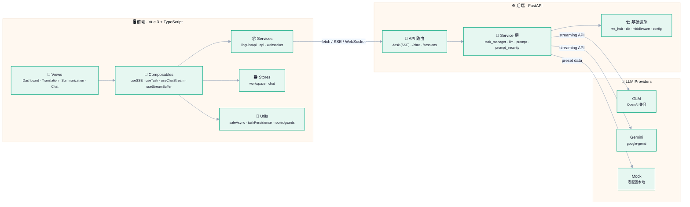

<div align="center">

# AdaWorks

### AI Native Workbench — 全栈 AI 工作台

[](LICENSE)
[](https://vuejs.org/)
[](https://fastapi.tiangolo.com/)
[](https://python.org/)
[](https://tailwindcss.com/)

将每种 LLM 能力统一为**可观测、可取消、可扩展**的流式任务。

新增一种 AI 能力 → 前端零改动，后端只加一个 Prompt 函数。

**在线演示**：[adaworks.site](http://adaworks.site)（Mock 模式，零配置体验）

</div>

---

<p align="center">
  
</p>

<p align="center"><strong>明暗双主题 · 10 种翻译语言 · 智能总结 · Agent 对话 · 零配置 Mock 模式</strong></p>

---

## ✨ 功能亮点

| | 功能 | 说明 |
|---|---|---|
| 🌐 | **多语言翻译** | 10 种语言 × 5 种语调，双栏实时对照，SSE 逐 token 流式，支持中途停止、语言互换、结果导出 |
| 📝 | **智能总结** | 长文一键提炼为概述 + 要点，LLM JSON Schema 校验 + 自动重试，保证结构化输出可靠 |
| 🤖 | **Agent 对话** | 可视化观察 Think → Act → Observe 推理过程，WebSocket Room 广播支持多标签页 |
| 🧭 | **智能路由** | 粘贴文本自动判断翻译 or 总结并跳转，关键词 + 长度启发式路由 |
| 💻 | **CLI 工具** | 终端内 `ai-app translate/summarize` 直接调用，Click + httpx SSE 流式 |
| 🎨 | **明暗主题** | 全局主题切换 + CSS 变量体系，响应式适配移动端 |
| 🔒 | **安全防护** | XML 标签隔离 + Prompt 安全规则 + Pydantic 输出校验 + 四级错误分级 + 语言一致性检查 |
| ⚡ | **流式性能** | 16ms 批量合并 token（60fps），协作式取消闭环，任务恢复 + 僵尸清理 |

---

## 🚀 快速上手

> 从克隆到运行，只需 4 步。**不需要任何 API Key，开箱即用。**

### 环境要求

| 工具 | 版本 | 检查 |
|---|---|---|
| Node.js | >= 18 | `node -v` |
| Python | >= 3.10 | `python3 --version` |
| Git | 任意 | `git --version` |

### Step 1：克隆

```bash
git clone https://gitee.com/renxiaodr/ada-ai-platform.git AdaWorks
cd AdaWorks
```

### Step 2：安装依赖

> 在 **项目根目录** 下执行，无需 `cd` 到子目录。

```bash
npm install
npm run sidecar:setup
```

| 命令 | 作用 |
|---|---|
| `npm install` | 安装前端依赖（Vue、Ant Design Vue、Tailwind 等） |
| `npm run sidecar:setup` | 在 `backend/` 下创建 Python 虚拟环境并安装依赖 |

### Step 3：启动

```bash
npm run dev:all
```

| 服务 | 地址 |
|---|---|
| Web UI | http://localhost:1420 |
| API 健康检查 | http://127.0.0.1:18765/api/health |

浏览器打开 http://localhost:1420 即可使用。**默认 Mock 模式**，无需密钥即可体验完整流式效果。

### Step 4（可选）：接入真实大模型

```bash
cp backend/.env.example backend/.env
```

编辑 `backend/.env`，改两行：

```
LLM_MODE=real
GLM_API_KEY=你的密钥
```

API Key 获取：[智谱开放平台](https://open.bigmodel.cn/) → 控制台 → 创建。保存后重启 `npm run dev:all` 生效。

### 常见问题

| 问题 | 解决 |
|---|---|
| `python3: command not found` | macOS：`brew install python@3.12` |
| `npm run sidecar:setup` 报错 | 手动创建：`python3 -m venv backend/.venv`，然后重新运行 |
| 侧栏显示"需配置密钥" | 正常——Mock 模式下功能完全可用 |
| `.env` 改了不生效 | `Ctrl+C` 停止后重新 `npm run dev:all` |
| 端口被占用 | 前端改 `frontend/vite.config.ts`；后端改 `--port` |
| `npm install` 慢 | `npm config set registry https://registry.npmmirror.com` |

---

## 🏗️ 技术架构

### 架构概览



### 系统分层



### 技术栈

| 层 | 选型 | 理由 |
|---|---|---|
| 前端 | Vue 3 + TypeScript + Vite | Composition API + 类型安全 |
| UI | Ant Design Vue + Tailwind CSS v4 | 复杂控件 + 自定义布局 |
| 状态 | Pinia (setup store) | 按业务域划分，TypeScript 推断优 |
| 后端 | FastAPI + Uvicorn | 原生 async + Pydantic 校验 |
| 数据库 | SQLite (aiosqlite) | 单文件零运维，可迁移 |
| 配置 | pydantic-settings | 类型安全环境变量 |
| LLM | GLM / Gemini / Mock | 三 Provider 抽象，零配置联调 |
| 实时 | SSE + WebSocket | 单向流式 + 双向实时 |
| 测试 | pytest + Vitest | 后端异步 + 前端组件 |

### 目录结构

```
AdaWorks/
├── frontend/src/
│   ├── components/          # 页面组件 (View→Panel→Leaf 三层分离)
│   │   ├── chat/            #   Agent Chat 模块
│   │   ├── TranslationView.vue
│   │   ├── SummarizationView.vue
│   │   └── DashboardView.vue
│   ├── composables/         # 业务逻辑 (useSSE, useTask, useChatStream)
│   ├── stores/              # 状态管理 (workspace, chat)
│   ├── services/            # 网络层 (HTTP, SSE, WebSocket)
│   └── utils/               # 纯函数 (safeAsync, taskPersistence)
│
├── backend/adaworks/
│   ├── api/                 # 路由层 (task, chat, sessions)
│   ├── services/            # 业务逻辑 (task_manager, llm, prompt)
│   ├── middleware/           # 请求管线 (BodyLimit, RequestId)
│   ├── ws_hub.py            # WebSocket Room 广播
│   ├── db.py                # 持久化 (aiosqlite + Lock)
│   └── config.py            # 配置中心 (pydantic-settings)
│
├── cli/                     # CLI 工具 (Click + httpx)
├── docs/                    # 架构文档、API 契约、使用手册
└── Makefile                 # test / build / lint
```

---

## 🔌 API 接口

> 完整规范见 [`docs/spec/api-design.md`](docs/spec/api-design.md)

### SSE 任务协议（翻译 / 总结）

```
POST /api/task { type, params } → SSE Stream
  event: task_start   → { taskId }
  event: token        → { content, seq }
  event: task_done    → { taskId, status, duration }
  event: task_error   → { taskId, message }
```

| 操作 | 方法 | 路径 |
|---|---|---|
| 提交任务 | `POST` | `/api/task` |
| 取消任务 | `DELETE` | `/api/task/{taskId}` |
| 查询状态 | `GET` | `/api/task/{taskId}` |
| 能力发现 | `GET` | `/api/functions` |
| 健康检查 | `GET` | `/api/health` |

### Agent 对话接口

| 操作 | 方法 | 路径 |
|---|---|---|
| 会话管理 | `GET/POST/DELETE` | `/api/sessions[/{id}]` |
| 发送消息 | `POST` | `/api/chat` |
| 实时推送 | `WebSocket` | `/ws/chat/{session_id}` |

---

## 🧪 测试与构建

```bash
make test            # 全部测试
make test-backend    # 后端 pytest
make test-frontend   # 前端 Vitest
make build           # 构建（含 vue-tsc 类型检查）
```

### Docker 部署

```bash
docker compose up --build
```

---

## 🗺️ 迭代路线

### v0.x — 已上线

- [x] 统一 SSE 任务协议 + TaskManager 状态机
- [x] 多语言翻译（10 语言 × 5 语调）
- [x] 智能总结（要点模式 + 概述模式 + JSON 校验）
- [x] Agent Chat（WebSocket Room + ReAct 步骤可视化）
- [x] Prompt 安全（XML 隔离 + 输出校验 + 语言一致性）
- [x] CLI 工具 + 明暗主题 + 响应式布局

### v0.9 — 开发中

- [ ] RAG 文档问答：ChromaDB + Embedding
- [ ] LangChain Agent 集成：Tool Calling 标准化
- [ ] MCP 工具协议：兼容 Claude / GPT 工具调用
- [ ] Docker 优雅停机 + 任务快照持久化
- [ ] PostgreSQL 迁移

### v1.0 — 规划中

- [ ] Redis 状态存储 + 多进程部署
- [ ] 用户认证：JWT + 多租户隔离
- [ ] 可观测性：OpenTelemetry + Prometheus
- [ ] 消息队列：Worker 水平扩展

---

## 📚 文档导航

> 完整文档目录见 [**docs/README.md**](docs/README.md)，包含工程化设计思想、文档依赖关系和开发者快速索引。

| 文档 | 说明 |
|---|---|
| [文档中心](docs/README.md) | 工程化设计思想 + 全量文档索引 |
| [架构详解](docs/architecture.md) | 前端分层、后端模块、数据流图 |
| [API 契约](docs/spec/api-design.md) | 统一 SSE 协议、请求/响应 Schema |
| [开发规范](docs/spec/development-standards.md) | SRP 分层、注释、错误处理标准 |
| [使用手册](docs/manual.md) | 功能说明、配置项、常见问题 |

---

## ⭐ Star History

[](https://star-history.com/#renxiaodr/ada-ai-platform&Date)

---

## 许可证

© 2026 RenXiaodi · [MIT License](LICENSE)
