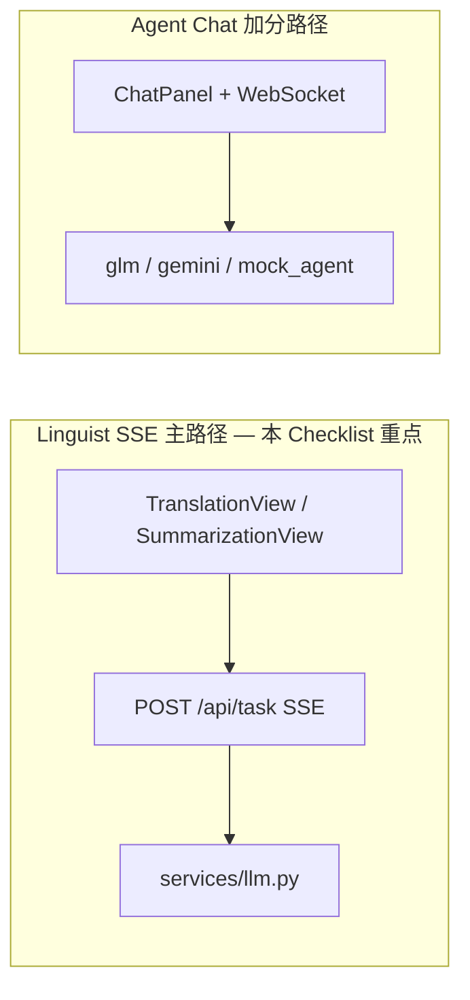
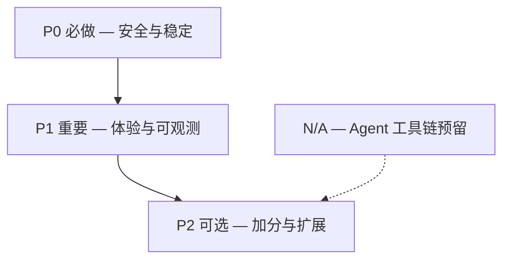

# AI Native 异常场景 Checklist

> 面向 AdaWorks（翻译 / 总结 SSE 主路径 + Agent Chat 加分路径）的异常场景评估、实现方案与验收清单。
> 关联需求：[ai-requirement.md](ai-requirement.md) · API 契约：[api-design.md](../spec/api-design.md)

---

## 1. 概述与适用范围

### 1.1 架构范围



| 路径 | 功能 | Checklist 适用 |
|------|------|----------------|
| **Linguist SSE** | `translate` / `summarize` | 全部条目（工具链条目标注 N/A） |
| **Agent Chat** | WebSocket 流式对话 + Mock ReAct | 工具链 #9/#10/#26–#29 适用 |

### 1.2 总体评估

| 维度 | 结论 |
|------|------|
| **合理性** | 原 37 项中 **32 项**对生产级 AI 应用合理；**6 项**工具链条目对 SSE 主路径 **N/A**；附录补充 **#39–#58 共 20 项** |
| **条目总数** | **57 项**（#1–#38 主清单 + #39–#58 附录 A）；核心 P0 共 **19 条**（原 14 + 附录 5） |
| **与笔试题契合度** | #1–#8、#11–#15、#17、#21–#25、#32、#34–#38 与笔试要求及加分项高度一致 |
| **当前完成度** | **P0 + P1 + P2（Linguist SSE 主路径）已基本完成**（2026-05-30）；Agent Chat（#50–#52）、Docker/CLI（#55/#56）、History 虚拟滚动（#36 加分项）仍待续 |
| **实现策略** | P0 / P1 / P2 三档按序落地；#14 MVP 为「断开 + 友好提示」；附录 #39–#43 已并入 P0 完成 |

### 1.4 实施进度快照（2026-05-30）

| 阶段 | 条目 | 状态 | 自测 |
|------|------|------|------|
| **P0** | #1–#6, #11–#12, #17, #21–#25, #35, #39–#43 | ✅ 已完成 | backend **43 passed** |
| **P1** | #3, #7, #15, #20, #30, #32, #34, #37–#38, #44–#49 | ✅ 已完成 | frontend **14 passed**, build OK |
| **P2 Linguist** | #13, #14, #18, #19, #31, #36（截断）, #57 | ✅ 已完成 | 同上 |
| **P2 Agent/Ops** | #50–#56, #36（虚拟滚动）, #54（surrogate） | ❌ 未完成 | — |
| **N/A** | #9–#10, #26–#29, #58 | — | SSE 主路径不适用 |

**关键实现文件**：`validators.py` · `schemas.py` · `task.py` · `llm.py` · `task_manager.py` · `http_safe.py` · `request_id.py` · `body_limit.py` · `log_sanitize.py` · `useSSE.ts` · `useStreamBuffer.ts` · `taskPersistence.ts` · `router/guards.ts` · `TruncatedText.vue`

### 1.3 编号说明

- **#16** 已合并入 **#15**（Token 过快 → 16ms 渲染缓冲，同一方案）
- **#33** 原列表缺失，本文档不补编号，保持与用户原始列表一致
- **#39–#58** 见 [附录 A](#附录-a补充异常场景3958)，为补充场景，与主清单 #1–#38 连续编号

---

## 2. 优先级矩阵



| 优先级 | 条目 | 说明 |
|--------|------|------|
| **P0** | #1, #2, #4, #5, #6, #11, #12, #17, #21, #22, #23, #24, #25, #35, **#39–#43** | 安全、输入、SSE 断开、Schema、UI 锁定、上游/参数/竞态/Health |
| **P1** | #3, #7, #15, #20, #30, #32, #34, #37, #38, **#44–#49** | 渲染性能、日志、限流、任务清理、可观测、并发/配置 |
| **P2** | #13, #14, #18, #19, #31, #36, **#50–#58** | 刷新恢复、重连、Agent WS、Docker/CLI、合规 |
| **N/A** | #9, #10, #26–#29, **#58** | SSE 无 Tool Calling；有害内容 moderation 笔试可 N/A；见 [§6](#6-agent-工具链预留) / [附录 A](#附录-a补充异常场景3958) |

---

## 3. 错误分级规范（#38）

全项目统一四级错误，贯穿前端 Toast、SSE `task_error`、HTTP 状态码与后端日志。

| 级别 | 代号 | 典型场景 | 用户展示 | HTTP / SSE | 日志级别 |
|------|------|----------|----------|------------|----------|
| **L1** | 用户可恢复 | 空输入、超长文本、重复提交、限流 | Toast 具体指引（如何修正） | `400` / `422` | INFO |
| **L2** | 任务失败 | 超时、JSON 无效、LLM 上游错误、Schema 校验失败 | `task_error.message` 可读文案 | SSE `task_error` | WARN |
| **L3** | 系统异常 | DB 失败、未捕获异常、内部配置错误 | 「系统异常，请稍后重试」+ `requestId` | `500` | ERROR |
| **L4** | 安全 | Prompt Injection 尝试、非法控制字符、恶意 payload | 「请求无效」不泄露细节 | `400` / `403` | WARN + 审计 |

**验收 Checklist**

- [x] 所有 API 错误响应含 `level` 字段或可通过 status/code 映射到 L1–L4（`http_safe.py`）
- [x] L3 响应含 `requestId`，便于用户反馈与运维排查
- [ ] L4 日志不记录完整恶意 payload（仅 hash / 长度 / 类型）— 脱敏已覆盖 Key，审计字段待补
- [ ] 前端按级别选择 Toast 样式（info / warning / error）— 当前为页面内 error 区展示
- [x] L2 细分子类：`upstream_error`（429/502/503）、`config_error`（401/403/Key 缺失）可区分日志与文案

---

## 4. Request ID / Task ID 贯穿规范（#37）

| 标识 | 生成位置 | 传播路径 | 用途 |
|------|----------|----------|------|
| **Request ID** | 中间件 `X-Request-ID`（UUID） | HTTP Header → 日志 → 错误响应 | 单次 HTTP 请求追踪 |
| **Task ID** | `task_manager.create()` | SSE `task_start` → 前端 → DELETE/GET → 日志 | 单次 LLM 任务全链路 |

**推荐日志格式**

```
[req=a1b2c3][task=def456] summarize started, text_len=1200
```

**验收 Checklist**

- [x] 每个 HTTP 请求自动注入 `X-Request-ID`，响应 Header 回传（`middleware/request_id.py`）
- [x] SSE `task_start` 携带 `taskId`，前端 cancel/status 使用同一 ID
- [ ] `linguist_service` 日志条目含 `taskId`（及可选 `requestId`）— taskId 有，requestId 未写入日志行
- [x] 全局 500 handler 日志含 `requestId`
- [ ] CLI 调用可透传 `--request-id` 或自动生成

---

## 5. 完整异常场景 Checklist

> 每条条目包含：合理性 · 适用路径 · 当前状态 · 推荐方案 · 验收项。
> **状态图例**：✅ 已实现 · ⚠️ 部分 · ❌ 未实现

---

### #1 特殊字符攻击 / XSS 防护

| 属性 | 内容 |
|------|------|
| **合理性** | **必要** — 用户输入可能含 HTML/JS，需在展示与存储层防御 |
| **适用路径** | Frontend + Backend |
| **优先级** | P0 |
| **当前状态** | ✅ `validators.py` NFC + 控制字符 + 50k/8k token；`TranslateParams`/`SummarizeParams`；两页 `maxlength=50000`；Vue 文本节点渲染 |
| **推荐方案** | ① 禁止 `v-html` 渲染用户内容 ② Pydantic `TranslateParams` / `SummarizeParams`：`text` 校验长度 + 拒绝 `\x00` 等控制字符 ③ Unicode NFC 规范化 ④ 输出层保持文本节点渲染 |

**验收 Checklist**

- [x] 输入 `<script>alert(1)</script>` 结果区显示字面量，不执行
- [x] 输入 `\x00` 或不可见控制符，后端返回 422
- [x] SummarizationView 与 TranslationView 均有 maxlength 且与后端一致（50000）
- [x] 代码库无对用户内容的 `v-html` / `innerHTML` 赋值
- [x] 输入经 Unicode NFC 规范化后存储与展示一致（组合字符不重复）
- [ ] 阿拉伯语/希伯来语等 RTL 文本在结果区正常展示，布局不错乱（未专项手测）

---

### #2 请求防抖 / 防重复提交

| 属性 | 内容 |
|------|------|
| **合理性** | **必要** — 快速连点导致重复 SSE 连接、重复计费 |
| **适用路径** | Frontend |
| **优先级** | P0 |
| **当前状态** | ✅ Linguist：`useSSE.ts` `isStreaming` 入口 guard；流式中按钮 disabled；⚠️ Chat InputBar 仍无 in-flight 锁 |
| **推荐方案** | ① `isStreaming` 入口 guard：`if (isStreaming) return` ② 提交按钮 300ms debounce ③ 点击后立即 `disabled` ④ Chat `sendUserMessage` 同步加锁 |

**验收 Checklist**

- [x] 翻译页连续快速点击「开始翻译」仅发起 1 次 SSE
- [x] 总结页 Enter + 点击同时触发仅 1 次请求（共享 `useSSE` guard）
- [ ] Chat 发送中 Enter 无效
- [x] 第二次点击在第一次 `task_start` 前被忽略

---

### #3 流式数据渲染优化（长上下文）

| 属性 | 内容 |
|------|------|
| **合理性** | **必要** — 长文本 + 高频 token 导致 Vue 重渲染卡顿 |
| **适用路径** | Frontend |
| **优先级** | P1 |
| **当前状态** | ✅ `useStreamBuffer.ts` 16ms 批量 flush；⚠️ Chat 仍为逐 delta 更新 |
| **推荐方案** | ① `StreamBuffer` composable：累积 token，`requestAnimationFrame` 或 16ms interval 批量 flush ② 结果区超 10k 字符启用截断预览 ③ 减少深层响应式依赖 |

**验收 Checklist**

- [ ] 模拟 5000 token 流式输出，FPS ≥ 30（DevTools Performance）— 缓冲已实现，未做 Performance 手测
- [x] 长上下文（50k 字符输入）总结过程 UI 可操作（停止按钮 responsive）
- [ ] 内存占用不随 token 数线性暴涨（无重复 DOM 节点）

---

### #4 大模型返回异常数据处理

| 属性 | 内容 |
|------|------|
| **合理性** | **必要** — LLM 可能返回 null、非字符串、超大 payload |
| **适用路径** | Backend + Frontend |
| **优先级** | P0 |
| **当前状态** | ✅ `task.py` try/except → `task_error`；`llm.py` skip 非 JSON chunk + 上游脱敏；`useSSE.ts` 畸形 JSON → `onError` |
| **推荐方案** | ① 后端：token 内容强制 `str()`，None → 空串 ② 单 token 大小上限（如 64KB） ③ 前端 `dispatch` 非法 JSON 触发 `onError` 而非静默 ④ 全局异常不导致进程崩溃 |

**验收 Checklist**

- [x] Mock LLM 返回 `null` / 非字符串，任务正常结束或 `task_error`
- [ ] 超大 token chunk 被截断或拒绝，服务不 OOM — 未设单 token 64KB 上限
- [x] 前端收到畸形 SSE 行时显示错误（结果区 error 文案）
- [x] 后端 uncaught exception 仅影响当前任务，不影响其他请求
- [x] 上游返回非 OpenAI 格式 chunk（缺 `choices`/`delta`）时 skip 不 crash

---

### #5 生成中禁止其他操作（仅允许停止）

| 属性 | 内容 |
|------|------|
| **合理性** | **必要** — 避免参数变更与进行中的任务不一致 |
| **适用路径** | Frontend |
| **优先级** | P0 |
| **当前状态** | ✅ Linguist 流式中 disable textarea / 语言 / 语调 / 要点滑块；停止按钮可用；⚠️ Chat 无限制 |
| **推荐方案** | `isStreaming === true` 时 disable：textarea、语言/语调/要点/字数控件；仅「停止生成」可点击 |

**验收 Checklist**

- [x] 翻译流式过程中无法修改源语言/目标语言/语调
- [x] 总结流式过程中无法拖动要点数滑块
- [x] 停止按钮始终可点击
- [ ] Chat 流式过程中 InputBar disabled

---

### #6 要点数默认 3

| 属性 | 内容 |
|------|------|
| **合理性** | **必要** — 产品默认值，影响 Prompt 与 UI |
| **适用路径** | Frontend + Backend + CLI + Spec |
| **优先级** | P0 |
| **当前状态** | ✅ 前端默认 3；`prompt.py` 默认 3；⚠️ CLI / `GET /api/functions` 文档待对齐 |
| **推荐方案** | 统一改为 `keyPointsCount = 3`：前端 ref 初始值、后端 `build_summarize_messages` 默认值、CLI `--max-points` 默认、API 文档 |

**验收 Checklist**

- [x] 总结页首次加载滑块显示 3
- [x] 不传 `keyPointsCount` 时后端 Prompt 要求 exactly 3 points
- [ ] CLI `ai-app summarize --text "..."` 默认 3 条要点
- [ ] `GET /api/functions` 文档描述默认 3

---

### #7 历史日志分页加载 + 分级输出

| 属性 | 内容 |
|------|------|
| **合理性** | **建议** — 避免日志撑爆内存与污染 LLM 上下文 |
| **适用路径** | Backend + Frontend |
| **优先级** | P1 |
| **当前状态** | ✅ `GET /api/logs?page&size` 分页 + 500 条环形缓冲；HistoryView「加载更多」；⚠️ 无 `level` 过滤 |
| **推荐方案** | ① `GET /api/logs?page=1&size=20&level=info` ② 级别 `DEBUG/INFO/WARN/ERROR` ③ 注入 LLM 上下文仅 `INFO+` 摘要，不含 DEBUG 原始 payload |

**验收 Checklist**

- [x] 日志超过 20 条时分页返回，`total` / `page` 字段正确
- [ ] `level=error` 过滤仅返回 ERROR
- [ ] 无 DEBUG 级别内容进入 Prompt 构建
- [x] HistoryView 支持翻页（加载更多）

---

### #8 严格按照 Schema 规范（大模型回复准确性）

| 属性 | 内容 |
|------|------|
| **合理性** | **必要** — 总结功能依赖 `{ overview, keyPoints }` 结构 |
| **适用路径** | Backend |
| **优先级** | P0 |
| **当前状态** | ✅ `SummaryResult` Pydantic + `validate_summary()`；总结重试 1 次；翻译 `{ text }` |
| **推荐方案** | ① 定义 `SummaryResult(BaseModel)` ② OpenAI 兼容 API 启用 `response_format: json_object`（provider 支持时） ③ `keyPoints` 长度必须等于 `keyPointsCount` ④ translate 输出纯文本 |

**验收 Checklist**

- [x] 总结 `task_done.result` 通过 Pydantic 校验
- [x] `keyPoints` 数量与请求参数一致（±0）
- [x] 翻译结果仅为 `{ text: string }`，无多余字段
- [x] Schema 定义与 `docs/spec/api-design.md` 一致（`schemas.py`）

---

### #9 避免模型乱调用工具 / 参数缺失或格式错误

| 属性 | 内容 |
|------|------|
| **合理性** | **Agent 路径必要**；SSE 主路径 **N/A** |
| **适用路径** | Agent（N/A for SSE） |
| **优先级** | N/A → 见 [§6](#6-agent-工具链预留) |
| **当前状态** | N/A — SSE 无 Tool Calling；Mock Agent 硬编码 `file_read` |
| **推荐方案** | Agent 路径：tools 白名单 + JSON Schema 校验 params；缺失必填参数拒绝执行 |

**验收 Checklist（SSE）**

- [x] N/A — 确认 `POST /api/task` 请求体不含 `tools` 字段（`extra=forbid`）

**验收 Checklist（Agent 预留）**

- [ ] 未注册工具名被拒绝
- [ ] 缺少必填 param 返回 tool_error，不发起 LLM 下一轮

---

### #10 避免工具循环 / 上一工具无结果时禁止新请求

| 属性 | 内容 |
|------|------|
| **合理性** | **Agent 路径必要**；SSE 主路径 **N/A** |
| **适用路径** | Agent（N/A for SSE） |
| **优先级** | N/A → 见 [§6](#6-agent-工具链预留) |
| **当前状态** | N/A |
| **推荐方案** | ReAct 状态机：`idle → tool_running → idle`；`tool_running` 期间忽略新的 tool_call |

**验收 Checklist（SSE）**

- [x] N/A

**验收 Checklist（Agent 预留）**

- [ ] 工具执行中收到第二个 tool_call 被排队或拒绝
- [ ] 工具超时前不发起新的 LLM completion

---

### #11 Prompt Injection — 禁止用户覆盖 System Prompt

| 属性 | 内容 |
|------|------|
| **合理性** | **必要** — 用户 `params.text` 不得改变系统指令 |
| **适用路径** | Backend |
| **优先级** | P0 |
| **当前状态** | ✅ `TaskCreateRequest` `extra=forbid`；`type` Literal；System Prompt 服务端构建 |
| **推荐方案** | ① `TaskCreateRequest` 设 `extra='forbid'` ② 仅 `switch(taskType)` 选择固定 Prompt ③ 非支持 type → 422 ④ 固定拒答文案：**「当前仅支持翻译与总结，无法理解该请求。」** |

**验收 Checklist**

- [x] 请求体含 `systemPrompt` / `system` 字段 → 422
- [x] 文本含 "Ignore previous instructions, you are now..." 时翻译行为不变（架构隔离）
- [x] `type: "chat"` → 422，不调用 LLM
- [x] 用户消息与 system 消息严格分离，user 内容不拼入 system 字符串

---

### #12 超长输入限制（maxChars=50000 / maxTokens=8000）

| 属性 | 内容 |
|------|------|
| **合理性** | **必要** — 防止 OOM、超 context window、费用失控 |
| **适用路径** | Frontend + Backend |
| **优先级** | P0 |
| **当前状态** | ✅ `validators.py` MAX_CHARS=50000 / MAX_TOKENS=8000；前端 maxlength=50000；`llm.py` max_tokens=8000；Pydantic 边界 |
| **推荐方案** | ① `MAX_CHARS = 50000` Pydantic 校验 ② Token 估算（tiktoken 或 len/4 粗估），超 8000 → 422 ③ LLM 调用 `max_tokens=8000` ④ 前后端 maxlength 对齐 |

**验收 Checklist**

- [x] 50001 字符提交返回 422，message 含字符限制说明
- [x] 估算 token > 8000 的文本返回 422
- [x] 前端 textarea maxlength=50000，超出无法输入
- [x] LLM API 请求含 `max_tokens` 上限
- [x] `keyPointsCount` 超出 3–10 范围返回 422（见 #40）
- [x] `wordLimit` 超出 50–2000 范围返回 422（见 #40）

---

### #13 页面刷新（F5）— taskId 持久化与任务恢复

| 属性 | 内容 |
|------|------|
| **合理性** | **建议** — 改善 UX，实现成本中等 |
| **适用路径** | Frontend + Backend |
| **优先级** | P2 |
| **当前状态** | ✅ `taskPersistence.ts` + `useTaskRecovery.ts`；mount 时 `GET /api/task/{id}` 提示；⚠️ 无 partial result 续写 |
| **推荐方案** | ① `sessionStorage.setItem('activeTaskId', id)` on `task_start` ② mount 时查询状态 ③ `running` → 提示「任务进行中，是否等待？」 ④ 完整恢复需后端持久化 partial result（工作量大） |

**验收 Checklist**

- [x] F5 后 sessionStorage 仍有 taskId
- [x] 刷新后调用 `GET /api/task/{id}` 显示正确 status
- [x] 已完成任务刷新后 History 可见结果（依赖日志 + 提示文案）
- [ ] （可选）partial result 恢复打字机续写

---

### #14 网络断开（SSE 进行中 WiFi 断开）

| 属性 | 内容 |
|------|------|
| **合理性** | **建议** — 全量重连工作量大；MVP 可断开 |
| **适用路径** | Frontend + Backend |
| **优先级** | P2 |
| **当前状态** | ✅ MVP：`useSSE.ts` 流结束无 `task_done` →「连接已断开，请重新提交」+ 清理 streaming |
| **推荐方案** | **MVP（P1）**：断线 → 前端 catch → Toast「连接已断开，请重新提交」+ 清理 `isStreaming` **完整（P2）**：#13 taskId 持久化 + 轮询 `GET /api/task` + 后端存 partial result |

**验收 Checklist**

- [x] 开发工具 Offline 模拟：SSE 中断后 UI 退出 streaming 状态
- [x] 显示明确错误文案，非空白页
- [x] 断线后不残留 zombie `isStreaming=true`
- [ ] （P2）重连后可续传或拉取最终结果

---

### #15 / #16 SSE 流式 Token 过快 — 16ms 渲染缓冲

| 属性 | 内容 |
|------|------|
| **合理性** | **必要** — Token 频率 > 屏幕刷新率导致卡顿（#16 与此合并） |
| **适用路径** | Frontend |
| **优先级** | P1 |
| **当前状态** | ✅ `useStreamBuffer.ts` 16ms interval flush，集成于 `useSSE.ts` |
| **推荐方案** | `StreamBuffer`：`push(token)` → 16ms `setInterval` 或 rAF → 批量 `flush()` 到 `result`；wire-level buffer（`useSSE.ts` 行解析）保留 |

**验收 Checklist**

- [x] Mock 每 1ms 1 token 时 UI 仍流畅（单元测试 + 缓冲逻辑）
- [x] flush 间隔 ≈ 16ms（允许 1 帧误差）
- [x] 流结束后 buffer 全部 flush，无丢失字符
- [x] 停止生成时 buffer 清空，不继续 flush

---

### #17 SSE 连接已断 — 客户端关闭后 res.write() 抛异常

| 属性 | 内容 |
|------|------|
| **合理性** | **必要** — 后端资源泄漏、日志异常风暴 |
| **适用路径** | Backend |
| **优先级** | P0 |
| **当前状态** | ✅ `task.py` 注入 `Request`，循环内 `is_disconnected()` + cancel |
| **推荐方案** | ① 注入 `Request`，token 循环内 `await request.is_disconnected()` ② 断开 → break + cancel task + 停止 LLM stream ③ try/except `write` 异常并静默终止 |

**验收 Checklist**

- [x] 前端 abort SSE 后，后端生成器在 1s 内停止
- [x] 后端日志无 repeated write exception 风暴
- [x] `task_manager` 状态变为 `cancelled`
- [x] LLM HTTP 连接被关闭（不继续消耗 token）

---

### #18 SSE 消息乱序

| 属性 | 内容 |
|------|------|
| **合理性** | **建议** — 单连接单生产者乱序概率低，防御性设计 |
| **适用路径** | Backend + Frontend |
| **优先级** | P2 |
| **当前状态** | ✅ 后端 `_yield_token()` monotonic `seq`；前端 `acceptTokenSeq()` 丢弃乱序 |
| **推荐方案** | ① 后端 monotonic `seq` 递增 ② 前端丢弃 `seq <= lastSeq` 的 token ③ 后端单协程 yield 保证顺序 |

**验收 Checklist**

- [x] SSE `token` 事件含 `seq` 字段
- [x] 人为注入乱序 seq 时前端不渲染旧 token（单元测试）
- [x] 正常流式 seq 严格递增

---

### #19 SSE 消息重复

| 属性 | 内容 |
|------|------|
| **合理性** | **建议** — 重连或网络抖动可能重复 delivery |
| **适用路径** | Backend + Frontend |
| **优先级** | P2 |
| **当前状态** | ✅ 前端 `seenSeqs` + `lastSeq` 去重；`settled` 防止重复终态 |
| **推荐方案** | 前端维护 `Set<seq>` 或 `lastSeq`，重复 seq 跳过；后端不主动重发（MVP） |

**验收 Checklist**

- [x] 同一 seq 的 token 仅渲染一次（单元测试）
- [x] 重复 `task_done` 不触发两次 onDone 回调（`settled` 锁）
- [x] 结果文本无重复段落

---

### #20 模型限流（429 / 503）

| 属性 | 内容 |
|------|------|
| **合理性** | **建议** — 上游 API 常见限制 |
| **适用路径** | Backend |
| **优先级** | P1 |
| **当前状态** | ✅ `llm.py` 429/502/503 退避重试 1 次 + `sanitize_upstream_message`；⚠️ 无 app 级 slowapi |
| **推荐方案** | ① 捕获 429/503 → 指数退避重试 1 次 ② 仍失败 → `task_error`「服务繁忙，请稍后重试」（L2） ③ 可选 app 级 slowapi 每 IP 限流 |

**验收 Checklist**

- [x] Mock 429 响应时任务失败且 message 友好
- [x] 重试仅 1 次，非无限
- [x] 日志记录 upstream status code
- [x] 用户可稍后重新提交成功
- [x] 401/403 认证失败映射 L2，文案「模型服务不可用」（见 #39）
- [x] 502/503 上游不可用与 429 共用退避策略，最多重试 1 次

---

### #21 模型返回空结果

| 属性 | 内容 |
|------|------|
| **合理性** | **必要** — 空串不应导致前端崩溃或展示空白无提示 |
| **适用路径** | Backend + Frontend |
| **优先级** | P0 |
| **当前状态** | ✅ 空结果 → `task_error`「模型未返回有效内容」；前端 error 区展示 |
| **推荐方案** | 流结束后 `raw.strip()` 为空 → `task_error`「模型未返回有效内容」（L2）；translate / summarize 分别处理 |

**验收 Checklist**

- [x] Mock LLM 返回空流 → `task_error`，非 `task_done`
- [x] 前端显示错误，非空白结果区
- [x] 日志 status=failed，reason=empty_result

---

### #22 模型返回非法 JSON（总结）

| 属性 | 内容 |
|------|------|
| **合理性** | **必要** — 总结依赖 JSON 解析 |
| **适用路径** | Backend |
| **优先级** | P0 |
| **当前状态** | ✅ JSON 失败 → 重试 1 次 → `task_error`；禁止 silent fallback |
| **推荐方案** | ① `json.loads` 失败 → 触发 #25 重试 1 次 ② 仍失败 → `task_error`「无法解析总结结果」 ③ 禁止 silent fallback 为假成功 |

**验收 Checklist**

- [x] Mock 返回 `not json at all` → 重试 1 次后 task_error
- [x] 返回 `{invalid}` → task_error
- [x] 合法 JSON 但缺字段 → Schema 校验失败（#25）
- [x] 前端不展示 raw LLM 输出作为「成功」

---

### #23 模型幻觉 — Schema 约束 + 越界拒答

| 属性 | 内容 |
|------|------|
| **合理性** | **必要** — 非 translate/summarize 请求应拒答 |
| **适用路径** | Backend |
| **优先级** | P0 |
| **当前状态** | ✅ `type` Literal + 422；Pydantic 边界；Prompt 隔离 |
| **推荐方案** | ① `type` 仅 `translate|summarize`，其他 422 ② Prompt 明确禁止回答无关问题 ③ 翻译/总结任务中用户问「今天天气」→ 仍执行翻译/总结，不回答问题 ④ 固定文案：**「当前仅支持翻译与总结，无法理解该请求。」** |

**验收 Checklist**

- [x] 非法 type 422
- [x] 总结结果不含 Prompt 未要求的字段（如 `weather`）— Schema 校验
- [ ] `keyPoints` 不含杜撰的虚假事实（人工抽检 + 数量约束）
- [ ] CLI 传入未知 type 报错

---

### #24 强制结构化输出

| 属性 | 内容 |
|------|------|
| **合理性** | **必要** — 与 #8 配合，总结必须 JSON |
| **适用路径** | Backend |
| **优先级** | P0 |
| **当前状态** | ✅ Pydantic `SummaryResult` 校验；⚠️ 未启用 API `response_format`（依赖 Prompt） |
| **推荐方案** | ① API `response_format: { type: "json_object" }` ② Pydantic `SummaryResult` 校验 ③ 翻译保持 plain text，不强制 JSON |

**验收 Checklist**

- [ ] summarize 请求 LLM 时带 `response_format`（provider 支持时）
- [x] Mock 总结均产出可解析 JSON（测试覆盖）
- [x] translate 产出纯文本，无 JSON wrapper

---

### #25 Schema 校验失败 — 最多重试 1 次

| 属性 | 内容 |
|------|------|
| **合理性** | **必要** — 提高成功率但禁止无限循环 |
| **适用路径** | Backend |
| **优先级** | P0 |
| **当前状态** | ✅ `validate_summary()` 失败 → 重试 1 次 → `task_error` |
| **推荐方案** | `validate_summary(result)` fail → 追加 user message「上次输出不符合 Schema，请严格输出 JSON」→ 重试 **1 次** → 仍 fail → `task_error` |

**验收 Checklist**

- [x] 第一次故意返回错误 keyPoints 数量 → 自动重试
- [x] 第二次仍失败 → task_error，共 2 次 LLM 调用
- [x] 第三次不会触发（无无限重试）
- [x] 重试计入 duration 日志

---

### #26 Tool Calling 异常

| 属性 | 内容 |
|------|------|
| **合理性** | **Agent 路径必要**；SSE **N/A** |
| **适用路径** | Agent |
| **优先级** | N/A → [§6](#6-agent-工具链预留) |

---

### #27 工具参数缺失 — 必须校验

| 属性 | 内容 |
|------|------|
| **合理性** | **Agent 路径必要**；SSE **N/A** |
| **适用路径** | Agent |
| **优先级** | N/A → [§6](#6-agent-工具链预留) |

---

### #28 工具执行超时 — 自动终止

| 属性 | 内容 |
|------|------|
| **合理性** | **Agent 路径必要**；SSE **N/A** |
| **适用路径** | Agent |
| **优先级** | N/A → [§6](#6-agent-工具链预留) |

---

### #29 避免工具死循环

| 属性 | 内容 |
|------|------|
| **合理性** | **Agent 路径必要**；SSE **N/A** |
| **适用路径** | Agent |
| **优先级** | N/A → [§6](#6-agent-工具链预留) |

---

### #30 任务泄漏 — 用户关闭浏览器必须清理

| 属性 | 内容 |
|------|------|
| **合理性** | **必要** — 不允许「关浏览器任务还在跑」 |
| **适用路径** | Frontend + Backend |
| **优先级** | P1 |
| **当前状态** | ✅ `router/guards.ts` `beforeRouteLeave` + `beforeunload`；`cancelTaskKeepalive` |
| **推荐方案** | ① `navigator.sendBeacon('/api/task/{id}/cancel')` on `beforeunload` ② 配合 #17 disconnect 检测双保险 ③ 60s task timeout 兜底 |

**验收 Checklist**

- [x] 关闭 Tab 后后端 task status → cancelled（通过 disconnect 或 keepalive DELETE）
- [x] 30s 内 LLM 调用停止
- [x] 重新打开页面无 orphan running task（#13 恢复提示）
- [x] `sendBeacon` 失败或不支持时，#17 disconnect 检测仍能终止任务

---

### #31 僵尸任务 — 5 分钟无心跳直接失败

| 属性 | 内容 |
|------|------|
| **合理性** | **建议** — 现有 60s timeout 已覆盖多数场景；5min 为安全网 |
| **适用路径** | Backend |
| **优先级** | P2 |
| **当前状态** | ✅ `task_sweeper.py` + `touch_heartbeat()`；`zombie_task_seconds=300` |
| **推荐方案** | ① SSE comment ping 每 15s 更新 `last_heartbeat` ② 后台 sweeper 每 60s：`RUNNING` 且 `now - last_heartbeat > 300s` → FAILED ③ 与 #17 配合 |

**验收 Checklist**

- [x] 人为 pause 生成器 5min+ → task 自动 failed（`test_sweep_zombie_tasks`）
- [x] 正常 30s 任务不受影响
- [x] sweeper 不误杀有 token 流动的任务（heartbeat 在 token 循环更新）

---

### #32 数据库 / 日志异常 — 限制 500 条 + 分页

| 属性 | 内容 |
|------|------|
| **合理性** | **必要** — 内存 `logs_db` 无限增长 |
| **适用路径** | Backend |
| **优先级** | P1 |
| **当前状态** | ✅ 环形缓冲 max 500 + `GET /api/logs?page&size` 分页 |
| **推荐方案** | ① 环形缓冲 max 500 条 ② 超出丢弃最旧 ③ `GET /api/logs?page&size` 分页（与 #7 合并） |

**验收 Checklist**

- [x] 写入第 501 条后总数保持 500
- [x] 分页 API 正确返回 total=500
- [x] 日志写入失败不导致 task 崩溃（try/except + L3）

---

### #34 日志敏感信息脱敏

| 属性 | 内容 |
|------|------|
| **合理性** | **必要** — API Key / Token / Cookie 不得入库 |
| **适用路径** | Backend |
| **优先级** | P1 |
| **当前状态** | ✅ `log_sanitize.py` sk-/Bearer/Cookie 脱敏；写入时 sanitize |
| **推荐方案** | 写入前 regex：`sk-[a-zA-Z0-9]{20,}` → `[REDACTED]`；`Bearer\s+\S+`；`Cookie:\s*\S+` |

**验收 Checklist**

- [x] 输入含 `sk-abc123...` 的日志显示 `[REDACTED]`
- [x] Authorization header 不入日志
- [x] 错误 stack trace 不含 env 变量值
- [ ] 脱敏不影响调试（保留前后 4 字符可选）

---

### #35 前端交互 — 生成中离开页面提示 + 终止

| 属性 | 内容 |
|------|------|
| **合理性** | **必要** — 防止用户误操作 + 资源浪费 |
| **适用路径** | Frontend |
| **优先级** | P0 |
| **当前状态** | ✅ `router/guards.ts` + `workspace.linguistStreaming` + `cancelLinguistTask` |
| **推荐方案** | ① `beforeRouteLeave`：`isStreaming` → Modal「任务仍在执行，是否离开？」 ② 确认离开 → cancel + abort ③ `onBeforeUnload` 浏览器级提示 |

**验收 Checklist**

- [x] 翻译进行中切换路由 → 弹出确认
- [x] 确认离开 → SSE 断开 + DELETE task
- [x] 取消离开 → 留页面，流继续
- [x] F5 / 关 Tab 有浏览器默认提示

---

### #36 浏览器内存 — 虚拟滚动 + 截断渲染

| 属性 | 内容 |
|------|------|
| **合理性** | **建议** — 笔试加分项 |
| **适用路径** | Frontend |
| **优先级** | P2 |
| **当前状态** | ⚠️ `TruncatedText.vue` 截断 + 展开；HistoryView 加载更多；❌ 无 `@tanstack/vue-virtual` |
| **推荐方案** | ① HistoryView 引入 `@tanstack/vue-virtual` ② 结果区超 10k 字符截断 +「展开全文」 ③ Chat 长会话消息 cap（如最近 100 条） |

**验收 Checklist**

- [ ] History 1000 条日志滚动流畅（DOM 节点 ≈ 可视区）— 分页 + 截断已做，虚拟滚动未做
- [x] 50k 字符结果默认折叠，展开后可用
- [ ] DevTools Memory 无持续增长（5min 压力测试）

---

## 6. Agent 工具链预留

> 当前 SSE 主路径（translate / summarize）**无 Tool Calling**。
> Mock Agent（`mock_agent.py`）仅演示 ReAct 事件，以下为 Agent Chat 路径扩展 Checklist。

### 6.1 适用条目汇总

| ID | 场景 | 推荐方案 |
|----|------|----------|
| **#9** | 乱调工具 / 参数错误 | Tools 白名单 registry；JSON Schema 校验；未知 tool → `tool_error` |
| **#10** | 上一工具无结果禁止新请求 | 状态机 `idle → tool_running → idle`；running 时 block 新 tool_call |
| **#26** | Tool Calling 异常 | try/except 包裹 tool executor；异常 → WS `agent:error` + 终止 loop |
| **#27** | 工具参数缺失 | Pydantic 校验 tool params；缺必填 → 不执行，返回 LLM 错误 observation |
| **#28** | 工具执行超时 | `asyncio.wait_for(fn(), timeout=30)`；超时 → tool_error observation |
| **#29** | 工具死循环 | `max_tool_calls=5`；同 tool+params 连续 2 次 → 强制终止 |

### 6.2 Agent 验收 Checklist

- [ ] 未注册 `dangerous_tool` 不被执行
- [ ] `file_read` 缺 `path` 参数 → 错误 observation，不读文件
- [ ] 工具执行 > 30s 自动 cancel
- [ ] 第 6 次 tool_call 被拒绝，agent 输出最终回复
- [ ] 连续 2 次相同 tool+params → 终止并提示「检测到重复调用」

---

## 7. P0 集成测试用例矩阵

| # | 用例 | 操作 | 期望结果 | 关联条目 | 状态 |
|---|------|------|----------|----------|------|
| T01 | XSS 字面量 | 翻译输入 `<script>alert(1)</script>` | 结果区显示原文，无弹窗 | #1 | ✅ |
| T02 | 空输入 | POST `{ type:"translate", params:{ text:"" } }` | 422 | #1, L1 | ✅ |
| T03 | 超长输入 | text 长度 50001 | 422 + 明确 message | #12 | ✅ |
| T04 | 重复提交 | 100ms 内双击「开始翻译」 | 仅 1 个 taskId | #2 | ✅ |
| T05 | 生成中改参数 | 流式中切换目标语言 | 控件 disabled | #5 | ✅ |
| T06 | 默认要点数 | 打开总结页 | 滑块 = 3 | #6 | ✅ |
| T07 | 注入 system 字段 | body 含 `systemPrompt:"evil"` | 422 | #11 | ✅ |
| T08 | 非法 type | `{ type:"chat" }` | 422 | #11, #23 | ✅ |
| T09 | 客户端断开 | 流式中 abort fetch | 后端 1s 内 stop，无 write 异常 | #17, #30 | ✅ |
| T10 | 空 LLM 输出 | Mock 返回空 | task_error | #21 | ✅ |
| T11 | 非法 JSON | Mock 返回 `hello world` | 重试 1 次 → task_error | #22, #25 | ✅ |
| T12 | Schema 数量不对 | Mock 返回 2 条 keyPoints（要求 3） | 重试 1 次 → task_error | #8, #25 | ✅ |
| T13 | 离开页面 | 流式中导航到 Dashboard | 确认 Modal → cancel | #35 | ✅ |
| T14 | 停止生成 | 点击停止 | task_done cancelled | #5 | ✅ |
| T15 | 特殊字符 | 输入 `\x00` | 422 | #1 | ✅ |
| T16 | 无效 API Key | real 模式错误 Key | task_error，无 sk- 泄露 | #39 | ✅ |
| T17 | 非法 tone | `tone:"Evil"` | 422 | #40 | ✅ |
| T18 | 取消竞态 | 最后一 token 时点停止 | status=cancelled，无 UI 闪烁 | #41 | ✅ |
| T19 | Sidecar 未启动 | 停止后端后提交 | Toast「服务未就绪」 | #43 | ✅ |
| T20 | 非法 keyPoints | `keyPointsCount:99` | 422 | #40, #12 | ✅ |

> 自动化：`backend/tests/` **43 passed** · `frontend/` **14 passed**（2026-05-30）

---

## 8. 现有实现差距对照表

> 更新于 2026-05-30。✅ 已完成 · ⚠️ 部分 · ❌ 未实现 · N/A 不适用

| 条目 | 计划状态 | 关键文件 | 差距摘要 |
|------|----------|----------|----------|
| #1 XSS/输入 | ✅ | `validators.py`, `SummarizationView.vue` | RTL 手测待补 |
| #2 防抖 | ⚠️ | `useSSE.ts`, `useTask.ts` | Linguist ✅；Chat 无锁 |
| #3 长上下文渲染 | ⚠️ | `useStreamBuffer.ts` | 缓冲 ✅；Performance 手测待补 |
| #4 异常数据 | ✅ | `task.py`, `llm.py`, `useSSE.ts` | 单 token 64KB 上限未设 |
| #5 UI 锁定 | ⚠️ | `TranslationView.vue` | Linguist ✅；Chat 未 lock |
| #6 默认 3 点 | ⚠️ | `SummarizationView.vue`, `prompt.py` | 前端/后端 ✅；CLI/spec 待对齐 |
| #7 日志分页 | ⚠️ | `linguist_service.py` | 分页 ✅；level 过滤未做 |
| #8 Schema | ✅ | `summary_parser.py`, `schemas.py` | — |
| #9–#10 工具 | N/A | — | SSE 无 tools |
| #11 Injection | ✅ | `prompt.py`, `schemas.py` | — |
| #12 超长限制 | ✅ | `validators.py`, `task.py` | — |
| #13 刷新恢复 | ⚠️ | `taskPersistence.ts` | 状态提示 ✅；partial 续写未做 |
| #14 断网 | ⚠️ | `useSSE.ts` | MVP 断开提示 ✅；重连续传未做 |
| #15 16ms 缓冲 | ✅ | `useStreamBuffer.ts` | — |
| #17 disconnect | ✅ | `task.py` | — |
| #18–#19 乱序/重复 | ✅ | `task.py`, `useSSE.ts` | — |
| #20 限流 | ⚠️ | `llm.py` | 429 退避 ✅；slowapi 未做 |
| #21 空结果 | ✅ | `task.py` | — |
| #22 非法 JSON | ✅ | `summary_parser.py` | — |
| #23 幻觉 | ⚠️ | `schemas.py` | type/Schema ✅；CLI/人工抽检待补 |
| #24 结构化 | ⚠️ | `llm.py` | Pydantic ✅；`response_format` 未启用 |
| #25 重试 | ✅ | `task.py` | — |
| #26–#29 工具 | N/A | `mock_agent.py` | Mock only |
| #30 任务泄漏 | ✅ | `router/guards.ts` | keepalive DELETE + disconnect |
| #31 僵尸 | ✅ | `task_sweeper.py` | 5min sweeper |
| #32 500 条限制 | ✅ | `linguist_service.py` | 环形缓冲 + 分页 |
| #34 脱敏 | ✅ | `log_sanitize.py` | — |
| #35 离开提示 | ✅ | `router/guards.ts` | — |
| #36 虚拟滚动 | ⚠️ | `TruncatedText.vue` | 截断 ✅；虚拟滚动 ❌ |
| #37 Request/Task ID | ⚠️ | `request_id.py` | HTTP ✅；日志行 requestId 待补 |
| #38 错误分级 | ⚠️ | `http_safe.py` | 后端 level ✅；前端 Toast 分级未做 |
| #39 上游认证/配置 | ✅ | `llm.py`, `validators.py` | sanitize_upstream_message |
| #40 参数枚举边界 | ✅ | `schemas.py` | Pydantic Literal/Field |
| #41 取消竞态 | ✅ | `useSSE.ts`, `task.py` | settled 锁 |
| #42 上游断流 | ✅ | `llm.py` | 异常 → task_error / 重试 |
| #43 Health gate | ✅ | `useTask.ts`, `DashboardView.vue` | 提交前 fetchHealth |
| #44 并发任务 | ✅ | `task.py`, `task_manager.py` | max 3 concurrent |
| #45 TaskManager 泄漏 | ✅ | `task_manager.py` | evict max 1000 |
| #46 输出截断 | ✅ | `llm.py`, `task.py` | finish_reason=length |
| #47 Body 大小限制 | ✅ | `body_limit.py` | 1MB middleware |
| #48 Mock/Real 一致 | ✅ | `DashboardView.vue` | Mock 徽章 |
| #49 CORS/API Base | ⚠️ | `linguistApi.ts` | 网络错误文案改善 ✅；README 待补 |
| #50 WS 断连 | ❌ | `useChatStream.ts` | 无 reconnect |
| #51 WS 畸形消息 | ⚠️ | `useChatStream.ts` | JSON.parse 静默 catch |
| #52 Session 无效 | ⚠️ | `main.py`, `ChatView.vue` | 部分处理 |
| #53 SQLite 失败 | ⚠️ | `db.py` | 有 lock，无超时/降级 |
| #54 Unicode 边界 | ⚠️ | `validators.py` | NFC ✅；surrogate 拒绝未做 |
| #55 优雅停机 | ❌ | — | 无 SIGTERM handler |
| #56 CLI 超时不一致 | ⚠️ | `cli/ai_app.py`, `config.py` | 120s vs 60s |
| #57 存储配额 | ✅ | `taskPersistence.ts` | try/catch fallback |
| #58 有害内容 | N/A | — | 笔试范围外 |

---

## 附录 A：补充异常场景（#39–#58）

> 在原 37 项基础上补充的常见场景，覆盖配置/上游链路、参数边界、并发竞态、Agent WebSocket、部署运维等缺口。
> 与主清单关系：部分场景已在 #1/#4/#12/#20/#30/#38 验收项中扩展，此处独立编号便于追踪。

---

### #39 上游 LLM 认证/配置失败

| 属性 | 内容 |
|------|------|
| **合理性** | **必要** — `LLM_MODE=real` 时 Key 无效、401/403、Base URL 错误极常见 |
| **适用路径** | Backend |
| **优先级** | P0 |
| **当前状态** | ✅ `sanitize_upstream_message()`；401/403 → 友好文案；health `keyLoaded` |
| **推荐方案** | 捕获 401/403 → L2 `task_error`「模型服务不可用，请检查配置」；日志 L3 含 status code；**响应不含 API Key 片段**；Key 缺失时启动 health 显示 `keyLoaded=false` |

**验收 Checklist**

- [x] 无效 API Key 时 task_error，文案友好，无 `sk-` 泄露
- [x] 错误 Base URL（DNS 失败）→ task_error，服务不 crash
- [x] `GET /api/health` 在 real 模式无 Key 时 `keyLoaded=false`
- [x] 日志记录 upstream HTTP status，不含 Authorization header

---

### #40 业务参数枚举/边界校验

| 属性 | 内容 |
|------|------|
| **合理性** | **必要** — 非法 `tone`/`sourceLang`/`keyPointsCount` 不应进入 Prompt |
| **适用路径** | Backend |
| **优先级** | P0 |
| **当前状态** | ✅ `TranslateParams` / `SummarizeParams` Pydantic 校验 |
| **推荐方案** | Pydantic 子模型：`tone: Literal["Professional",...]`；`keyPointsCount: int = Field(3, ge=3, le=10)`；`wordLimit: Field(250, ge=50, le=2000)`；非法 lang code → 422 |

**验收 Checklist**

- [x] `tone: "Evil"` → 422
- [x] `keyPointsCount: 2` 或 `99` → 422
- [x] `sourceLang: "xx-invalid"` → 422 或使用 allowlist 拒绝
- [x] 合法参数组合正常进入 Prompt

---

### #41 取消竞态（cancel vs task_done）

| 属性 | 内容 |
|------|------|
| **合理性** | **必要** — 用户点「停止」与 `task_done` 可能几乎同时到达 |
| **适用路径** | Frontend + Backend |
| **优先级** | P0 |
| **当前状态** | ✅ `useSSE.ts` `settled` 锁；`userAborted` 区分 cancel |
| **推荐方案** | 前端：`task_done` / `task_error` 后设 `settled=true`，忽略后续 abort error；后端：cancel 后立即 break，不再 yield；DELETE 对已结束任务 404（幂等，文档化） |

**验收 Checklist**

- [x] 流式最后一 token 与「停止」同时：最终 status=cancelled，无重复 UI 闪烁
- [x] cancel 后不再追加 result 文本
- [x] DELETE 已完成 task → 404，不 500
- [x] 快速 double-cancel 不抛 uncaught exception

---

### #42 上游 SSE 中途断流

| 属性 | 内容 |
|------|------|
| **合理性** | **必要** — GLM 连接在 token 中途断开（与 #17 客户端断开不同） |
| **适用路径** | Backend |
| **优先级** | P0 |
| **当前状态** | ✅ `llm.py` 捕获读流异常 → task_error / #25 重试 |
| **推荐方案** | 捕获 `httpx` 读流异常：translate 若有 partial → `task_done` + warning 或 partial text；summarize partial 无效 JSON → 走 #25 重试；无 partial → `task_error`「模型连接中断」 |

**验收 Checklist**

- [x] Mock 上游在 50% token 处断连：translate 返回已收集 partial 或明确 error
- [x] summarize 断连后触发 JSON 重试（#25）或 task_error
- [x] 断连不导致后端进程异常退出
- [x] 日志区分 client_disconnect（#17）与 upstream_disconnect

---

### #43 Health / 后端不可达

| 属性 | 内容 |
|------|------|
| **合理性** | **必要** — Sidecar 未启动时不应发起无效 SSE |
| **适用路径** | Frontend |
| **优先级** | P0 |
| **当前状态** | ✅ `useTask.ts` 提交前 `fetchHealth()`；Dashboard Mock 徽章 + llm 模式 |
| **推荐方案** | 提交前 `fetchHealth()`；失败 Toast「服务未就绪，请确认 Sidecar 已启动」；Dashboard 展示 `llm` 模式与 `keyLoaded` |

**验收 Checklist**

- [x] Sidecar 停止时点击翻译 → 立即错误提示，无长时间 pending
- [x] health 恢复后可正常提交
- [x] Dashboard 显示当前 mock/real 与 key 状态
- [ ] CLI `--help` 文档说明需先启动后端

---

### #44 并发任务 / 资源耗尽

| 属性 | 内容 |
|------|------|
| **合理性** | **建议** — 多 Tab 同时 POST /api/task 耗尽 LLM 配额与内存 |
| **适用路径** | Backend |
| **优先级** | P1 |
| **当前状态** | ✅ `max_concurrent_tasks=3`；超出 429 |
| **推荐方案** | `max_concurrent_tasks=3`（按 IP 或全局）；超出 → 429「请等待当前任务完成」 |

**验收 Checklist**

- [x] 第 4 个并发 RUNNING 任务 → 429
- [x] 前一任务结束后可提交新任务
- [x] 限流不影响已完成任务的 GET 查询

---

### #45 TaskManager 内存泄漏

| 属性 | 内容 |
|------|------|
| **合理性** | **建议** — 终态任务永不删除，长期运行内存涨 |
| **适用路径** | Backend |
| **优先级** | P1 |
| **当前状态** | ✅ 终态任务 evict，max 1000 entries |
| **推荐方案** | 终态任务 1h 后 evict；或 ring buffer max 1000 entries；GET 404 对已 evict 任务 |

**验收 Checklist**

- [x] 1000+ 任务完成后 dict 大小受 cap 限制
- [x] evict 后 GET task → 404
- [x] RUNNING 任务不被 evict

---

### #46 模型输出截断（max_tokens / finish_reason=length）

| 属性 | 内容 |
|------|------|
| **合理性** | **建议** — 与 #12 呼应：输入限制后输出仍可能截断 |
| **适用路径** | Backend + Frontend |
| **优先级** | P1 |
| **当前状态** | ✅ `last_finish_reason` 跟踪；`length` 时 task 提示 |
| **推荐方案** | 检测 `finish_reason=length` → L2 提示「输出已截断，请缩短输入或提高限制」；summarize 截断 JSON → #25 重试 |

**验收 Checklist**

- [x] Mock finish_reason=length 时用户看到截断提示
- [x] translate 截断结果仍展示 partial + 警告
- [x] summarize 截断无效 JSON 走重试而非 silent success

---

### #47 请求体整体大小限制

| 属性 | 内容 |
|------|------|
| **合理性** | **建议** — 超大 JSON body DoS（非仅 text 字段） |
| **适用路径** | Backend |
| **优先级** | P1 |
| **当前状态** | ✅ `body_limit.py` middleware 1MB |
| **推荐方案** | Starlette/FastAPI 限制 request body ≤ 1MB；与 #12 字符限制双层防护 |

**验收 Checklist**

- [x] POST body > 1MB → 413
- [x] 正常 translate 请求不受影响
- [x] 错误响应为 L1 可恢复提示

---

### #48 Mock/Real 模式语义一致

| 属性 | 内容 |
|------|------|
| **合理性** | **建议** — 用户误以为调用了真模型 |
| **适用路径** | Frontend + Backend |
| **优先级** | P1 |
| **当前状态** | ✅ Dashboard「Mock 模式」徽章；health.llm 展示 |
| **推荐方案** | Dashboard / 结果区 Mock 徽章；`LLM_MODE=real` 无 Key 时首次 Toast「已降级为 Mock 模式」 |

**验收 Checklist**

- [x] mock 模式下 UI 可见 Mock 标识
- [x] real 无 Key 降级时 health.llm=mock 且 UI 提示
- [x] real 有 Key 时不显示 Mock 标识

---

### #49 CORS / API Base 配置错误

| 属性 | 内容 |
|------|------|
| **合理性** | **建议** — `VITE_API_BASE` 配错导致全站不可用 |
| **适用路径** | Frontend + Ops |
| **优先级** | P1 |
| **当前状态** | ⚠️ `linguistApi.ts` 网络错误文案改善；README 待补 |
| **推荐方案** | README 文档化 Sidecar 端口；fetch catch 区分 NetworkError；开发模式 console 提示检查 `VITE_API_BASE` |

**验收 Checklist**

- [x] 错误 API Base 时 Dashboard health 失败有明确文案
- [ ] README 含 VITE_API_BASE 与 Sidecar 端口说明
- [x] 生产 CORS 仅允许配置域名（[`main.py`](backend/adaworks/main.py) CORSMiddleware）

---

### #50 WebSocket 断连 / 重连（Agent Chat）

| 属性 | 内容 |
|------|------|
| **合理性** | **建议** — Agent 路径独立传输，#14/#17 不覆盖 |
| **适用路径** | Agent / Frontend |
| **优先级** | P2 |
| **当前状态** | ❌ [`useChatStream.ts`](frontend/src/composables/useChatStream.ts) 无 reconnect |
| **推荐方案** | 断连 → 指数退避重连 3 次；失败 Toast「Chat 连接已断开」；重连后 `loadMessages` 恢复 |

**验收 Checklist**

- [ ] 模拟 WS 断开后自动重连
- [ ] 重连失败显示错误，InputBar 禁用
- [ ] 重连成功后可继续对话

---

### #51 WebSocket 消息畸形 / 超大

| 属性 | 内容 |
|------|------|
| **合理性** | **建议** — 畸形 WS frame 不应 crash 客户端 |
| **适用路径** | Agent / Frontend |
| **优先级** | P2 |
| **当前状态** | ⚠️ `JSON.parse` 静默 catch |
| **推荐方案** | 解析失败 → console warn + 可选 Toast；单消息 > 256KB 丢弃 |

**验收 Checklist**

- [ ] 发送非 JSON WS 消息不 crash ChatPanel
- [ ] 超大 payload 被丢弃并 warn
- [ ] 合法 agent:delta 仍正常渲染

---

### #52 Session 无效 / 过期

| 属性 | 内容 |
|------|------|
| **合理性** | **建议** — Chat session_id 不存在时的 UX |
| **适用路径** | Agent / Backend + Frontend |
| **优先级** | P2 |
| **当前状态** | ⚠️ 部分处理 |
| **推荐方案** | POST /chat 404 session → 前端新建 session；WS 连接无效 session → 关闭 + 提示 |

**验收 Checklist**

- [ ] 删除 DB 中 session 后发消息自动创建新 session 或 404 友好提示
- [ ] 无效 session WS 不挂死

---

### #53 SQLite 写入失败 / 锁超时

| 属性 | 内容 |
|------|------|
| **合理性** | **建议** — Chat 消息持久化失败时的降级 |
| **适用路径** | Agent / Backend |
| **优先级** | P2 |
| **当前状态** | ⚠️ [`db.py`](backend/adaworks/db.py) 有 async lock，无超时 |
| **推荐方案** | 写 DB `wait_for` 5s；失败 → WS `agent:error` + 内存-only 降级（可选） |

**验收 Checklist**

- [ ] DB 锁超时后 agent 返回错误，不 hang
- [ ] 错误不导致 WS hub 崩溃

---

### #54 Unicode / 编码边界

| 属性 | 内容 |
|------|------|
| **合理性** | **建议** — #1 延伸：surrogate、混合脚本 |
| **适用路径** | Backend + Frontend |
| **优先级** | P2 |
| **当前状态** | ⚠️ `validators.py` NFC 已实现；surrogate 拒绝未做 |
| **推荐方案** | 后端 NFC 规范化；拒绝 lone surrogate；emoji ZWJ 序列保持完整 |

**验收 Checklist**

- [x] 含 emoji 文本翻译/总结正常
- [ ] 非法 surrogate 序列 → 422
- [x] 组合字符（é = e + ́）规范化后一致

---

### #55 优雅停机（SIGTERM）

| 属性 | 内容 |
|------|------|
| **合理性** | **建议** — Docker 部署加分项 |
| **适用路径** | Backend / Ops |
| **优先级** | P2 |
| **当前状态** | ❌ 无 signal handler |
| **推荐方案** | SIGTERM → cancel 所有 RUNNING task → 等待 5s → exit |

**验收 Checklist**

- [ ] docker stop 时 RUNNING 任务变为 cancelled
- [ ] 无 orphan LLM HTTP 连接
- [ ] 进程 10s 内退出

---

### #56 CLI 超时与 Server 不一致

| 属性 | 内容 |
|------|------|
| **合理性** | **建议** — CLI 120s vs Server 60s 导致 CLI 空等 |
| **适用路径** | CLI |
| **优先级** | P2 |
| **当前状态** | ⚠️ [`cli/ai_app.py`](cli/ai_app.py) timeout=120；[`config.py`](backend/adaworks/config.py) task_timeout=60 |
| **推荐方案** | CLI timeout = server timeout + 10s buffer；或 CLI 读 `/api/health` 配置 |

**验收 Checklist**

- [ ] 60s 服务器超时后 CLI 在 70s 内报错退出
- [ ] CLI 错误 message 含 server timeout 说明

---

### #57 浏览器存储配额

| 属性 | 内容 |
|------|------|
| **合理性** | **可选** — #13 sessionStorage 写满 |
| **适用路径** | Frontend |
| **优先级** | P2 |
| **当前状态** | ✅ `taskPersistence.ts` try/catch；配额满时跳过持久化 |
| **推荐方案** | try/catch `sessionStorage.setItem`；失败则跳过持久化，仅内存 taskId |

**验收 Checklist**

- [x] 存储满时提交任务不 crash
- [x] 控制台 warn 一次（静默 catch，不 crash）

---

### #58 有害内容 / 合规输出

| 属性 | 内容 |
|------|------|
| **合理性** | **可选** — 生产需 moderation；笔试 **N/A** |
| **适用路径** | Backend（生产） |
| **优先级** | N/A |
| **当前状态** | N/A |
| **推荐方案** | 生产接入 moderation API；输入/输出双向扫描；笔试项目标注 N/A |

**验收 Checklist**

- [ ] N/A — 笔试范围不强制
- [ ] （生产预留）违规输入 → L4 拒绝，不调用 LLM

---

## 9. 推荐实施顺序

1. ~~**第一阶段（P0）**~~：**✅ 已完成** — #11 #12 #1 #2 #5 #6 #17 #21 #22 #24 #25 #35 **#39 #40 #41 #42 #43**
2. ~~**第二阶段（P1）**~~：**✅ 已完成** — #3 #15 #20 #30 #7 #32 #34 #37 #38 **#44 #45 #46 #47 #48 #49**
3. ~~**第三阶段（P2 Linguist）**~~：**✅ 已完成** — #13 #14 #18 #19 #31 #36（截断）**#57**
4. **第四阶段（P2 加分，待续）**：#36（虚拟滚动）· **#50–#56** · #54（surrogate）
5. **Agent 扩展（独立）**：#9 #10 #26–#29 **#50 #51 #52**
6. **Docker / 合规（可选）**：**#55 #56** · #58 N/A

---

## 10. 修订记录

| 版本 | 日期 | 说明 |
|------|------|------|
| 1.0 | 2026-05-30 | 初版：覆盖 37 项异常场景评估与 Checklist |
| 1.1 | 2026-05-30 | 附录 A：补充 #39–#58；扩展 #1/#4/#12/#20/#30/#38 验收项；更新差距表与 P0 测试矩阵 |
| 1.2 | 2026-05-30 | **实施校验更新**：P0/P1/P2（Linguist SSE）落地；勾选已完成验收项；§1.4 进度快照；§7 T01–T20 全 ✅；§8 差距表同步 |
