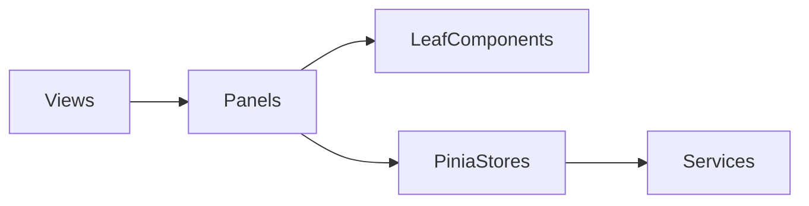

# AI TextFlow — 功能清单与技术方案

> 面向 AI Native 开发工程师笔试，3天交付期
> 标记说明：`[必做]` 基础门槛 | `[亮点]` 核心考察点/拉开差距 | `[加分]` 加分项 | `[时间]` 预估工时

---

## 〇、改造原则（基于现有代码增量演进）

> **核心约束**：在现有AdaWorks AI工作区代码上改造，**不重做 UI**；导航从 `activeView` 组件切换**迁移为 Vue Router**。
> 面试题要求的 SSE 流式 / 取消 / task 契约等能力，通过**底层 API 与 composable 层**接入，页面视觉与交互保持现状。

| 原则                         | 说明                                                                                                                                                                        |
| ---------------------------- | --------------------------------------------------------------------------------------------------------------------------------------------------------------------------- |
| **UI 不动**                  | 工作台、翻译页、总结页、History、Settings、Sidebar 等现有样式与功能全部保留，仅改造数据请求层（非流式 → SSE + 停止按钮）                                                    |
| **导航改 Vue Router**        | 将 `App.vue` 中 `activeView` + `<component :is>` 改为 **Vue Router 4** + `<router-view>`；`Sidebar` 用 `router-link` / `useRoute` 高亮；卡片与快捷输入用 `router.push` 跳转 |
| **工作台即入口**             | 功能入口沿用 `DashboardView`：「文本翻译」「智能要点总结」双卡片 + 快捷输入框智能跳转，**不新建 HomeView，不改为三卡片列表**                                                |
| **翻译保留多语言**           | 翻译页继续支持 10 种源/目标语言 + 5 种语调，**不限定为 zh↔en**；后端 task 参数与现有 `TranslationView` 对齐                                                                 |
| **主题用 Ant Design Vue**    | 明暗切换通过 `a-config-provider` 的 `theme.algorithm`（`darkAlgorithm` / `defaultAlgorithm`）实现                                                                           |
| **后端在 adaworks 包内扩展** | 在 `backend/adaworks/` 现有 `main.py` 基础上新增 `services/`、`api/` 等模块，保留会话/聊天/日志等已有路由                                                                   |
| **Agent Chat 保留**          | 侧边栏「智能体对话」模块不变，与主线文本处理解耦（详见 §六）                                                                                                                |

---

## 一、功能清单（按优先级排序）

### Phase 1 — 基础必做（约 1.5 天）

| #   | 功能                      | 优先级            | 说明                                                                                                                        |
| --- | ------------------------- | ----------------- | --------------------------------------------------------------------------------------------------------------------------- | ----------------- |
| F0  | Vue Router 迁移           | `[必做]`          | 引入 `vue-router@4`；`App.vue` 改为 `<router-view>`；`Sidebar` 路由导航；全局状态（logs、quickText）上移至 Pinia            |
| F1  | 工作台入口                | `[必做]`          | **保留现有** `DashboardView`：文本翻译 + 智能要点总结双卡片 + 快捷输入跳转，UI 不改动；卡片点击 `router.push('/translation' | 'summarization')` |
| F2  | 翻译页                    | `[必做]`          | **保留现有** `TranslationView`：多源/目标语言（10种）、语调选择、双栏对照；底层改为 SSE 流式 + 停止                         |
| F3  | 总结页                    | `[必做]`          | **保留现有** `SummarizationView`：要点数/字数上限/语调/文件导入；底层改为 SSE 流式 + 停止                                   |
| F4  | SSE 流式渲染              | `[必做]` `[亮点]` | 前端接收 SSE 逐 token 渲染，打字机效果                                                                                      |
| F5  | 停止/取消任务             | `[必做]` `[亮点]` | 前端中断 SSE 连接 + 调用 DELETE 接口取消后端任务                                                                            |
| F6  | GET /api/functions        | `[必做]`          | 返回功能列表及描述（**供 CLI / SKILL.md 使用**；前端工作台不依赖此接口）                                                    |
| F7  | POST /api/task (SSE)      | `[必做]` `[亮点]` | 提交任务，SSE 流式返回 taskId + 结果                                                                                        |
| F8  | DELETE /api/task/{taskId} | `[必做]`          | 取消正在执行的任务                                                                                                          |
| F9  | LLM 调用层                | `[必做]`          | 封装大模型调用，保留真实调用链路，支持 mock 模式                                                                            |

### Phase 2 — CLI & Agent（约 0.5 天）

| #   | 功能           | 优先级            | 说明                                                       |
| --- | -------------- | ----------------- | ---------------------------------------------------------- |
| F10 | CLI 工具       | `[必做]` `[亮点]` | `ai-app translate` / `ai-app summarize` 命令，调用后端 API |
| F11 | SKILL.md       | `[必做]` `[亮点]` | Agent 可识别的技能描述文件，含调用协议                     |
| F12 | Agent 调用截图 | `[必做]`          | Claude Code 发现并执行 CLI 工具的截图证据                  |

### Phase 3 — 加分项（约 1 天，按性价比排序）

| #   | 功能                | 优先级            | 说明                                                                         |
| --- | ------------------- | ----------------- | ---------------------------------------------------------------------------- |
| F13 | agent.md            | `[加分]` `[亮点]` | 描述 AI Agent 在项目中的角色、协作方式、开发流程                             |
| F14 | docs/spec/ 规范目录 | `[加分]` `[亮点]` | 需求拆分、接口设计、页面原型等规范文件                                       |
| F15 | 请求参数校验        | `[加分]`          | Pydantic schema 校验，统一错误响应格式                                       |
| F16 | 统一错误处理        | `[加分]`          | 全局异常中间件，标准化错误码                                                 |
| F17 | 日志追踪            | `[加分]`          | 请求级 traceId 贯穿前后端日志                                                |
| F18 | 任务超时控制        | `[加分]`          | 单任务超时自动终止，防止模型调用挂死                                         |
| F19 | 深色/浅色主题       | `[加分]`          | Ant Design Vue `a-config-provider` 切换 `darkAlgorithm` / `defaultAlgorithm` |
| F20 | 响应式布局          | `[加分]`          | **已有** Tailwind 响应式类，保持现状即可                                     |
| F21 | 异步任务队列        | `[加分]` `[亮点]` | 内存任务队列，任务状态机 pending→running→done/failed                         |
| F22 | 任务状态轮询        | `[加分]`          | 前端轮询任务进度，展示 pending/running 状态                                  |
| F23 | 调用记录查询页      | `[加分]` `[亮点]` | **已有** `HistoryView` + 内存日志，保持现状                                  |
| F24 | Docker 支持         | `[加分]`          | Dockerfile + docker-compose 一键启动                                         |

> `[亮点]` 集中的项是面试官重点关注的能力指标，建议优先实现。

---

## 二、技术方案

### 2.1 整体架构

```
┌──────────────┐     SSE/REST     ┌──────────────┐     Stream     ┌──────────┐
│   Frontend   │ ◄──────────────► │   Backend    │ ◄────────────► │  LLM API │
│ (Vue 3+Vite) │                  │  (FastAPI)   │                │          │
└──────────────┘                  └──────────────┘                └──────────┘
       ▲                                ▲
       │  HTTP (REST)                   │  HTTP (REST)
       │                                │
┌──────────────┐                  ┌──────────────┐
│  CLI Tool    │                  │  Task Queue  │
│  (click)     │                  │  (in-memory) │
└──────────────┘                  └──────────────┘
                                         ▲
                                  ┌──────┴───────┐
                                  │  Call Log DB │
                                  │  (SQLite)    │
                                  └──────────────┘
```

### 2.2 技术栈选型

| 层级   | 选型                                                | 理由                                                                          |
| ------ | --------------------------------------------------- | ----------------------------------------------------------------------------- |
| 前端   | **Vue 3 + TypeScript + Vite**                       | 现有工程，Composition API + composable 封装 SSE                               |
| UI     | **Ant Design Vue + Tailwind CSS + lucide-vue-next** | Ant 负责 ConfigProvider/主题/表单反馈；Tailwind 负责布局间距                  |
| 导航   | **Vue Router 4**                                    | 替代 `activeView` 切换；Sidebar `router-link`；支持浏览器前进/后退与 URL 直达 |
| 状态   | **Pinia**                                           | 已有 `stores/chat.ts`；文本任务状态放 composable ref，不必强制进 store        |
| 后端   | **Python FastAPI**                                  | 原生 async + SSE 支持、开发效率高、题目建议选项                               |
| 数据库 | **SQLite**                                          | 零配置、满足调用记录存储、加分项数据闭环                                      |
| LLM    | **OpenAI 兼容 API（智谱/DeepSeek）+ Mock 模式**     | 保留真实调用链路，无 Key 时可降级为 mock                                      |
| CLI    | **Python Click**                                    | 与后端同语言、开发快、题目建议选项                                            |
| 容器   | **Docker + docker-compose**                         | 一键启动前后端，加分项                                                        |

### 2.3 前端设计（基于现有结构，UI 不改动，导航改 Router）

#### 页面结构（Vue Router 4）

```
frontend/src/
├── App.vue                          # 根组件：a-config-provider + Sidebar + router-view
├── router/
│   └── index.ts                     # 路由表（新增 [F0]）
├── components/
│   ├── Sidebar.vue                  # 侧边栏 — router-link 导航 + useRoute 高亮
│   ├── DashboardView.vue            # /dashboard [F1]
│   ├── TranslationView.vue          # /translation [F2]
│   ├── SummarizationView.vue        # /summarization [F3]
│   ├── HistoryView.vue              # /history [F23]
│   ├── SettingsView.vue             # /settings
│   └── chat/                        # Agent Chat 子组件（§六）
├── views/
│   └── ChatView.vue                 # /chat — 智能体对话页
├── stores/
│   ├── chat.ts                      # 已有 — Agent Chat 状态
│   └── workspace.ts                 # 新增 — logs、quickText、apiConnected 等跨页状态
├── composables/
│   ├── useChatStream.ts             # 已有
│   ├── useSSE.ts                    # 新增 [F4]
│   └── useTask.ts                   # 新增 [F5,F7,F8]
├── services/
│   ├── linguistApi.ts               # 改造
│   ├── api.ts                       # 已有
│   └── websocket.ts                 # 已有
└── types.ts                         # 已有
```

#### 路由表

| 路径             | name            | 组件                    | 说明                    |
| ---------------- | --------------- | ----------------------- | ----------------------- |
| `/`              | —               | redirect → `/dashboard` | 默认入口                |
| `/dashboard`     | `dashboard`     | `DashboardView`         | 工作台双卡片 + 快捷输入 |
| `/translation`   | `translation`   | `TranslationView`       | 文本翻译                |
| `/summarization` | `summarization` | `SummarizationView`     | 智能要点总结            |
| `/chat`          | `chat`          | `ChatView`              | Agent Chat（加分）      |
| `/history`       | `history`       | `HistoryView`           | 运行日志                |
| `/settings`      | `settings`      | `SettingsView`          | 全局设置                |

> `main.ts` 注册 `app.use(router)`；`App.vue` 移除 `activeView` / `<component :is>` / `KeepAlive` 手动切换逻辑，改由 `<router-view>` 渲染；跨页共享的 `logs`、`quickText` 从 props 下沉到 `stores/workspace.ts`（或 composable + provide）。

#### 关键交互逻辑

**Router 迁移** (`[必做]` [F0], 视觉不变)

- 安装 `vue-router@4`，新增 `router/index.ts`
- `Sidebar.vue`：`emit('update:activeView')` 改为 `router-link` 或 `router.push`，高亮基于 `useRoute().name`
- `DashboardView.vue`：卡片跳转改为 `router.push({ name: 'translation' })` 等；快捷输入跳转同理，通过 Pinia 写入 `quickText` 后导航
- `App.vue`：保留 `a-config-provider` + `Sidebar` 布局壳，主内容区仅 `<router-view />`

**工作台入口** (`[必做]`, UI 不动)

- `DashboardView` 展示「文本翻译空间」「智能要点总结」两张卡片，点击 `router.push` 进入对应路由
- 底部快捷输入框：智能跳转翻译/总结路由，并携带 `quickText`（经 workspace store）

**SSE 流式渲染** (`[亮点]`, 仅改数据层)

- 新增 `useSSE` composable：`fetch + ReadableStream` 解析 SSE 事件，逐 token 更新 ref
- `TranslationView` / `SummarizationView` 在现有结果区实时追加文本（打字机效果），**不新建 StreamOutput 组件、不改布局**

**任务取消** (`[亮点]`)

- composable 内 `AbortController` + `DELETE /api/task/{taskId}`
- 在现有「开始翻译/生成总结」按钮旁增加「停止生成」按钮（流式进行中显示）

**主题切换** (`[加分]`)

- 在 `App.vue` 或 `Sidebar` 增加切换控件
- 通过 `a-config-provider` 的 `:theme="{ algorithm: isDark ? darkAlgorithm : defaultAlgorithm }"` 切换
- **不用** Tailwind `dark:` 前缀或独立 CSS 变量体系重做主题

### 2.4 后端设计（在 `adaworks/` 包内增量扩展）

#### 目录结构（在现有代码上新增）

```
backend/
├── requirements.txt                 # 追加 pydantic-settings、sse-starlette 等
├── .env / .env.example
└── adaworks/                        # 现有 FastAPI 应用包
    ├── main.py                      # 已有 — 注册新路由 + 保留 sessions/chat/logs/health
    ├── db.py                        # 已有 — SQLite 会话持久化
    ├── ws_hub.py                    # 已有 — WebSocket 广播
    ├── glm_agent.py / gemini_agent.py / mock_agent.py  # 已有 — Agent Chat
    ├── linguist_service.py          # 已有 — prompt/日志；流式逻辑迁移至 services/
    ├── bootstrap_env.py / env_secrets.py  # 已有
    │
    ├── config.py                    # 新增 — pydantic-settings（LLM_MODE/超时/端口）
    ├── services/                    # 新增
    │   ├── llm.py                   #   统一 stream(prompt) mock|real
    │   ├── prompt.py                #   翻译/总结 prompt（承接 linguist_service 逻辑）
    │   └── task_manager.py          #   内存任务队列 + 状态机 + 取消 + 超时
    ├── api/                         # 新增
    │   ├── router.py                #   聚合 functions + task 子路由
    │   ├── schemas.py               #   Pydantic 请求/响应模型
    │   ├── functions.py             #   GET /api/functions
    │   └── task.py                  #   POST /api/task (SSE), DELETE, GET status
    └── middleware/                  # 新增 [加分]
        ├── error_handler.py         #   统一错误处理
        └── trace.py                 #   traceId 日志
```

#### API 设计

**GET /api/functions**（供 CLI / Agent 发现能力；前端工作台不消费）

```json
{
  "functions": [
    {
      "id": "translate",
      "name": "文本翻译",
      "description": "多语言翻译，支持源/目标语言与语调",
      "params": {
        "text": "string",
        "sourceLang": "string",
        "targetLang": "string",
        "tone": "string"
      }
    },
    {
      "id": "summarize",
      "name": "智能要点总结",
      "description": "长文本总结，支持要点数/字数上限/语调",
      "params": {
        "text": "string",
        "keyPointsCount": "number",
        "wordLimit": "number",
        "tone": "string"
      }
    }
  ]
}
```

**POST /api/task** → SSE 响应

```
请求（翻译）:
{ "type": "translate", "params": { "text": "...", "sourceLang": "auto", "targetLang": "zh", "tone": "Professional" } }

请求（总结）:
{ "type": "summarize", "params": { "text": "...", "keyPointsCount": 5, "wordLimit": 250, "tone": "Professional" } }

SSE 事件流:
event: task_start
data: {"taskId": "xxx"}

event: token
data: {"content": "Hello"}

event: task_done
data: {"taskId": "xxx", "status": "done", "duration": 1.2, "result": {...}}
```

> 总结任务：`token` 事件推送原始流式文本；`task_done.result` 携带解析后的 `{overview, keyPoints}` 供 History 结构化存储。

**DELETE /api/task/{taskId}**

```json
{ "message": "task cancelled", "taskId": "xxx" }
```

#### 任务状态机 (`[加分]` `[亮点]`)

```
pending ──► running ──► done
   │           │
   │           └──────► failed
   │
   └──────► cancelled
```

- 内存队列：`dict[str, TaskContext]`，TaskContext 持有 `asyncio.Task` 引用
- 取消时调用 `asyncio.Task.cancel()` + 中断 LLM stream

#### LLM 调用层

```python
class LLMService:
    async def stream(self, prompt: str) -> AsyncIterator[str]: ...
```

- 真实模式：复用 `glm_agent.py` 已有 OpenAI 兼容 SSE 解析，stream=True
- Mock 模式：`asyncio.sleep` 模拟逐字输出，**无 Key 时翻译/总结/CLI 均可演示**
- 通过环境变量 `LLM_MODE=mock|real` 切换
- Prompt 构建：`services/prompt.py` 承接 `linguist_service.py` 现有 system prompt（多语言、语调、要点数、字数上限）

### 2.5 CLI 工具 (`[必做]` `[亮点]`)

```bash
# 翻译
ai-app translate --text "你好世界" --from zh --to en
ai-app translate --text "Hello"    --from en --to zh

# 总结
ai-app summarize --text "长文本内容..." --max-points 3

# 查看功能列表
ai-app list
```

- 使用 Python Click 实现
- 直接调用后端 API（非绕过后端直接调 LLM）
- 支持流式输出（终端逐字打印）

### 2.6 SKILL.md 设计 (`[必做]` `[亮点]`)

```markdown
# AI Text Processing Tool

Translate text between Chinese and English, or summarize long text.

## Usage

### translate

Translate text between languages.

- Arguments: --text (required), --from (zh/en, required), --to (zh/en, required)

### summarize

Summarize long text into key points.

- Arguments: --text (required), --max-points (default: 3)

## Examples

ai-app translate --text "Hello world" --from en --to zh
ai-app summarize --text "..." --max-points 5
```

> 此文件放在项目根目录 `.claude/skills/` 下，Claude Code 可自动发现。

### 2.7 开发流程文件 (`[加分]` `[亮点]`)

**agent.md** — 记录 AI Agent 协作方式：

- Agent 担任的角色（架构设计、代码生成、测试编写、Code Review）
- 人机协作边界（人类决策 vs Agent 执行）
- Prompt 策略和迭代记录

**docs/spec/ 目录结构**：

```
docs/spec/
├── requirements.md     # 需求拆分（功能点 → 子任务）
├── api-design.md       # 接口规范（请求/响应/错误码）
├── page-mockup.md      # 页面线框图（ASCII 或描述）
└── task-breakdown.md   # 任务分解与工时估算
```

---

## 三、面试官关注点分析

根据题目关键词 "AI Native"，面试官核心考察维度：

| 考察维度          | 对应功能                        | 体现方式                                              |
| ----------------- | ------------------------------- | ----------------------------------------------------- |
| **AI Agent 理解** | SKILL.md + Agent 调用截图       | 证明理解 Agent 工具链协议，能设计 Agent 可调用的工具  |
| **流式处理能力**  | SSE 全链路                      | 前后端 SSE 闭环，是 AI 应用的基础能力                 |
| **工程规范意识**  | docs/spec/ + agent.md + SDD/TDD | 证明不是随便写 demo，而是有规范驱动的工程素养         |
| **全栈能力**      | 前端 + 后端 + CLI + Docker      | 端到端交付能力                                        |
| **AI 辅助开发**   | agent.md 中的协作描述           | 证明能高效利用 AI 工具开发（这就是 AI Native 的核心） |

---

## 四、实现优先级建议（3 天排期）

### Day 0 — Router 迁移（前置）

- [ ] 安装 `vue-router@4`；新增 `router/index.ts` 路由表
- [ ] `App.vue` 改为 `<router-view>`；`Sidebar` 改 `router-link` 高亮
- [ ] 新增 `stores/workspace.ts`（logs、quickText、apiConnected）；各 View 从 store 读写，移除 props 透传

### Day 1 — 后端 SSE 核心 + 前端 composable

- [ ] `adaworks/config.py` + `services/llm.py`（mock 模式）+ `services/prompt.py`
- [ ] `GET /api/functions`、`POST /api/task` SSE、`DELETE /api/task/{id}`
- [ ] 前端 `useSSE.ts` + `useTask.ts`；改造 `linguistApi.ts`
- [ ] `TranslationView` / `SummarizationView` 接入 SSE 流式 + 停止按钮（**UI 布局不动**）

### Day 2 — 取消闭环 + CLI + real 模式

- [ ] `task_manager.py` 取消 + 超时；前后端取消闭环验收
- [ ] 接入真实 GLM API（`LLM_MODE=real`）；mock 无 Key 演示路径保留
- [ ] CLI 工具 + SKILL.md；参数校验 + 统一错误处理

### Day 3 — 加分项 + 文档

- [ ] 任务状态轮询（可选 GET /api/task/{id}）
- [ ] Ant Design Vue 明暗主题切换（`a-config-provider`）
- [ ] Docker 支持；agent.md + docs/spec/ 目录；README 完善

---

## 五、项目结构总览（基于现有 AdaWorks 仓库）

```
AdaWorks/
├── frontend/                        # Vue 3 + Vite + TS + Ant Design Vue + Tailwind（现有）
│   └── src/
│       ├── App.vue                  # 根组件：a-config-provider + Sidebar + router-view
│       ├── router/index.ts          # 路由表 [F0]（新增）
│       ├── components/
│       │   ├── Sidebar.vue          # 侧边栏 — router-link 导航
│       │   ├── DashboardView.vue    # /dashboard [F1]
│       │   ├── TranslationView.vue  # /translation [F2]
│       │   ├── SummarizationView.vue# /summarization [F3]
│       │   ├── HistoryView.vue      # /history [F23]
│       │   ├── SettingsView.vue     # /settings
│       │   └── chat/                # Agent Chat 组件
│       ├── views/ChatView.vue       # /chat
│       ├── stores/
│       │   ├── chat.ts              # 已有
│       │   └── workspace.ts         # 新增 — 跨页共享状态
│       ├── composables/
│       │   ├── useChatStream.ts     # 已有
│       │   ├── useSSE.ts            # 新增 [F4]
│       │   └── useTask.ts           # 新增 [F5,F7,F8]
│       ├── services/
│       │   ├── linguistApi.ts       # 改造
│       │   ├── api.ts               # 已有
│       │   └── websocket.ts         # 已有
│       └── types.ts                 # 已有
│
├── backend/                         # Python FastAPI Sidecar（现有 adaworks 包 + 增量模块）
│   └── adaworks/
│       ├── main.py                  # 已有 — 挂载新路由，保留 chat/sessions/logs
│       ├── config.py                # 新增
│       ├── services/{llm,prompt,task_manager}.py  # 新增
│       ├── api/{router,schemas,functions,task}.py  # 新增
│       └── middleware/{error_handler,trace}.py     # 新增 [加分]
│
├── cli/                             # 新增 [F10]
│   ├── ai_app.py
│   └── setup.py
├── .claude/skills/SKILL.md          # 新增 [F11]
├── docs/spec/                            # 新增 [F14]
├── agent.md                         # 新增 [F13]
├── Dockerfile + docker-compose.yml  # 新增 [F24]
├── scripts/sidecar.mjs              # 已有 — 启动 Sidecar
└── README.md                        # 更新
```

### 文件与功能映射速查

| 功能编号     | 前端文件                                                           | 后端文件                                | 说明                                  |
| ------------ | ------------------------------------------------------------------ | --------------------------------------- | ------------------------------------- |
| F0 Router    | `router/index.ts`, `stores/workspace.ts`, `App.vue`, `Sidebar.vue` | —                                       | activeView → Vue Router 迁移          |
| F1 工作台    | `DashboardView.vue`（保留 UI）                                     | —                                       | 双卡片 + 快捷输入，`router.push` 跳转 |
| F2 翻译页    | `TranslationView.vue`（保留 UI，改 SSE）                           | `services/prompt.py`                    | 多语言+语调，非 zh↔en 限定            |
| F3 总结页    | `SummarizationView.vue`（保留 UI，改 SSE）                         | `services/prompt.py`                    | 要点/字数/语调/导入                   |
| F4 流式渲染  | `useSSE.ts`                                                        | `api/task.py`                           | SSE 全链路，结果区逐字追加            |
| F5 停止/取消 | `useTask.ts` + 页面内停止按钮                                      | `api/task.py`, `task_manager.py`        | abort + DELETE                        |
| F6 功能列表  | —（CLI 用）                                                        | `api/functions.py`                      | GET /api/functions                    |
| F7 提交任务  | `useTask.ts`, `linguistApi.ts`                                     | `api/task.py`                           | POST /api/task (SSE)                  |
| F8 取消任务  | `linguistApi.ts`                                                   | `api/task.py`                           | DELETE /api/task/:id                  |
| F9 LLM 调用  | —                                                                  | `services/llm.py`, `services/prompt.py` | mock + real                           |
| F10 CLI      | —                                                                  | —                                       | `cli/ai_app.py`                       |
| F19 主题切换 | `App.vue` a-config-provider                                        | —                                       | Ant Design Vue algorithm 切换         |
| F20 响应式   | 各 View 已有 Tailwind 断点                                         | —                                       | 保持现状                              |
| F21 任务队列 | —                                                                  | `services/task_manager.py`              | 内存队列 + 状态机                     |
| F22 状态轮询 | 可选状态徽标                                                       | `api/task.py` GET status                | 进度展示                              |
| F23 调用记录 | `HistoryView.vue`（已有）                                          | `linguist_service.py` logs              | 内存日志闭环                          |
| F24 Docker   | —                                                                  | —                                       | Dockerfile, docker-compose.yml        |

---

## 六、保留的对话功能（Agent Chat 加分模块）

> 在面试题文本翻译与智能总结之外，项目额外保留了一个**多轮对话（Agent Chat）**模块，作为"真实流式 + ReAct 步骤展示"的加分演示。
> 它与主线 SSE 文本处理**解耦并存**、互不影响。

### 6.1 已实现能力清单

- **对话系统**：多轮对话；用户消息先落库，随后异步触发模型，过程经 WebSocket 实时推送。
- **ReAct 步骤展示**：Think / Act / Observe / 最终结果 分块组件（Mock 模型完整演示该循环）。
- **流式输出**：GLM / Gemini 真实 SSE 增量 → `agent:delta`，前端打字机式追加渲染。
- **会话管理**：会话列表、新建、删除、消息历史；SQLite 持久化，重启可恢复。
- **多模型后端**：GLM（智谱，优先）/ Gemini（次选）/ Mock（无 Key 演示），按环境变量密钥自动选择。
- **健康检查**：`GET /api/health` 返回当前 LLM 模式（glm / gemini / mock）与 `keyLoaded`。

### 6.2 技术栈与端口

- 前端：**Vue 3 + TypeScript + Pinia + Ant Design Vue + Tailwind CSS**；根组件 `a-config-provider` 暗色算法。
- 后端：**Python FastAPI Sidecar**；SQLite（`aiosqlite`）；按 `session_id` 分组的 WebSocket 房间广播。
- 端口：Sidecar `18765`（HTTP + WebSocket）；Vite Dev `1420`。
- 密钥：仓库根 `.env` 与 `backend/.env` 叠加加载（后者覆盖）；支持 JSON 数组分段密钥拼接。

### 6.3 SRP 分层架构（前端）

| 层级     | 路径约定                                 | 单一职责（一个变更理由）                       | 禁止                       |
| -------- | ---------------------------------------- | ---------------------------------------------- | -------------------------- |
| View     | `src/views/*.vue`                        | 路由/页面壳：布局槽位、子组件拼装              | 不写 `fetch`、不拼业务 URL |
| 编排     | `*Panel.vue`                             | 组合子组件、绑定 props/emit、调用 store action | 不手写 WS 帧解析           |
| 展示叶子 | `MessageBubble.vue`、`ThinkBlock.vue` 等 | 给定 props 的纯展示（+ 局部折叠 UI 状态）      | 不调 API、不读 Pinia       |
| 组合逻辑 | `src/composables/*.ts`                   | 单一场景流程（如订阅 WS 流并追加消息）         | 不持有跨域全局状态         |
| 状态     | `src/stores/*.ts`                        | 单一业务域：会话、消息、连接状态               | 不直接操作 DOM             |
| 传输     | `src/services/{api,websocket}.ts`        | HTTP/WS 序列化、baseURL、错误包装              | 不含 Vue 组件逻辑          |

数据流：`View → Panel → Leaf`；`Panel → Store → Service`，无逆向绕路。

**Linguist 工作台（Translation / Summarization）简化形态：** 业务编排已下沉至 composable（`useTask`、`useLinguistTaskLog` 等），页面可采用 **单文件双栏模板 + 共享 Leaf**（如 `ApiKeyBanner`），**不强制**拆成 `*Panel.vue` + Input/Result Leaf。Chat 模块因 6+ 种消息类型 Leaf，必须严格 View → Panel → Leaf。



已实现的关键文件：`views/ChatView.vue`、`components/chat/{ChatPanel,MessageBubble,InputBar,ThinkBlock,ActionBlock,ObservationBlock,FinalResult}.vue`、`composables/useChatStream.ts`、`stores/chat.ts`、`services/{api,websocket}.ts`、`types/chat.ts`。

### 6.4 后端模块（`backend/adaworks/`）

| 文件                  | 职责                                                                                                                 |
| --------------------- | -------------------------------------------------------------------------------------------------------------------- |
| `main.py`             | 应用入口 `create_app()`；注册路由；`lifespan` 连接 SQLite、挂载 `ChatHub`；`POST /api/chat` 异步触发 GLM/Gemini/Mock |
| `db.py`               | SQLite（aiosqlite）：建表、`sessions`/`messages` 行转换                                                              |
| `ws_hub.py`           | 按 `session_id` 维护连接列表，`broadcast()` 下发 `{type, payload}`                                                   |
| `glm_agent.py`        | 智谱 GLM：OpenAI 兼容 `chat/completions` `stream:true`，逐段 `agent:delta`，结束 `agent:final` 落库                  |
| `gemini_agent.py`     | Google Gemini：`generate_content_stream` 逐块 `agent:delta`                                                          |
| `mock_agent.py`       | 无 Key 时模拟 ReAct（think/act/observe）+ 分段 delta                                                                 |
| `bootstrap_env.py`    | 加载根 `.env` 与 `backend/.env`                                                                                      |
| `env_secrets.py`      | 密钥解析（支持 JSON 数组分段拼接）                                                                                   |
| `linguist_service.py` | 翻译/总结服务与内存日志（主线文本处理，详见 §一~§五）                                                                |

### 6.5 已实现的 API 与 WebSocket 事件

```
POST   /api/chat                       # 发消息，异步触发 Agent（过程经 WS 推送）
GET    /api/sessions                   # 会话列表
POST   /api/sessions                   # 新建会话
DELETE /api/sessions/{id}              # 删除会话
GET    /api/sessions/{id}/messages     # 会话消息历史
GET    /api/health                     # 健康检查（llm 模式 + keyLoaded）

WS  /ws/chat/{session_id}
  服务端 → 客户端：agent:delta / agent:think / agent:act / agent:observe / agent:final / agent:error
```

数据模型（SQLite）：

```sql
CREATE TABLE sessions (
  id TEXT PRIMARY KEY, title TEXT NOT NULL, model_id TEXT,
  created_at TEXT DEFAULT (datetime('now')), updated_at TEXT DEFAULT (datetime('now'))
);
CREATE TABLE messages (
  id TEXT PRIMARY KEY, session_id TEXT NOT NULL,
  role TEXT NOT NULL,            -- user | assistant | think | act | observe
  content TEXT NOT NULL, metadata TEXT,
  created_at TEXT DEFAULT (datetime('now')),
  FOREIGN KEY (session_id) REFERENCES sessions(id) ON DELETE CASCADE
);
```

### 6.6 后续扩展能力（规划方向，本期不实现）

以下为可演进的方向，仅作能力登记，本期不实现：

- **Tauri v2 桌面壳**：现以 Web 应用形态运行（`npm run dev:all`），未接入 `src-tauri/`。
- **模型管理**：`/api/models` CRUD、连接测试、多 Provider（OpenAI/Claude/Ollama）配置 UI（当前模型锁定 GLM，Settings 页只读）。
- **RAG 知识库**：文档上传/分块/ChromaDB 向量检索/上下文注入。
- **技能系统**：YAML 技能定义、触发关键词、启用/禁用。
- **MCP 客户端**：stdio / SSE 传输、Server 连接管理、工具自动发现。
- **工具系统真实执行**：`file_read` / `file_write` / `terminal_execute` 的真实执行与安全沙箱（当前 Mock 仅演示 think/act/observe）。
- **会话增强**：重命名、首条消息自动命名、清空当前会话；WebSocket `user:interrupt` 中断。

### 6.7 开发规范（强制）

完整条文见 **`docs/spec/development-standards.md`**，摘要：

| 条目     | 要求                                                                           |
| -------- | ------------------------------------------------------------------------------ |
| SRP      | 逻辑抽取 composable/service，禁止多文件重复实现                                |
| 注释     | 所有模块、函数、方法必须有备注（JSDoc / docstring）                            |
| 前端错误 | async / fetch / IO 必须 try/catch 或使用 `utils/safeAsync.runSafe`             |
| 后端错误 | 全局 exception handler + SSE 生成器内 try/except                               |
| API      | 翻译/总结仅 `POST /api/task`，禁止独立 `/api/translate`、`/api/summarize` 路由 |
