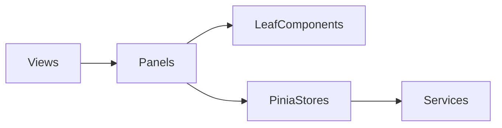

# plan.md：组件单一职责（SRP）与可行代码骨架

## 背景与约束

- 当前 [spec.md](./spec.md) 已定义前端目录（实现上为 **`frontend/src/components/chat/`** 等）、技术栈（**Vue 3 + TypeScript + Ant Design Vue + Tailwind CSS**），以及 §8.1（`<script setup lang="ts">`、TS 严格模式、**中文注释**）。
- `plan.md` 作为实现时的架构契约，避免「上帝组件」混写请求、状态与 UI。

## 文档结构

1. **SRP 分层表**（谁负责什么、变更原因是什么）
2. **与 spec 目录的一一映射**（每个文件夹的职责一句话）
3. **反例与正例**（简短对照）
4. **数据流示意**（Mermaid）
5. **最小可行代码块**（可直接拷贝进工程；类型与 API 与 spec §5.1 对齐）

---

## 1. SRP 分层表

| 层级 | 路径约定 | 单一职责（一个变更理由） | 禁止 |
|------|-----------|--------------------------|------|
| View | `src/views/*.vue` | 路由级页面壳：布局槽位、子组件拼装 | 不写 `fetch`、不直接拼业务 URL |
| 容器 / 编排 | `*Panel.vue`、`*View` 内薄层 | 组合子组件、绑定 props/emit、调用 store action | 不实现 Markdown 解析、不手写 WS 帧解析 |
| 展示叶子 | `MessageBubble.vue`、`ThinkBlock.vue` 等 | 给定 props 的纯展示（+ 局部 UI 状态如折叠） | 不调 API、不读 Pinia（本项目建议避免 inject 业务状态） |
| 组合逻辑 | `src/composables/*.ts` | 单一场景流程：如「发送消息并订阅流」 | 不持有跨域全局状态 |
| 状态 | `src/stores/*.ts` | 单一业务域：会话列表、消息列表、连接状态 | 不直接操作 DOM |
| 传输 | `src/services/api.ts`、`websocket.ts` | HTTP/WS 序列化、baseURL、错误包装 | 不包含 Vue 组件逻辑 |

**composables 使用约定**：当某段逻辑超过约 30 行、或涉及 WebSocket 订阅与消息追加等可复用流程时，从 `ChatPanel` 等编排组件抽到 `composables/`，编排组件只保留 `useXxx()` 调用与模板拼装。

---

## 2. 与 spec 组件树的映射

- `chat/ChatPanel.vue`：只负责**对话区编排**（消息列表 + 输入栏 + 加载态），消息数据来自 `stores/chat`。
- `chat/MessageBubble.vue`：只负责**一条消息的气泡样式**（用户/AI、Markdown 容器占位）。
- `chat/ThinkBlock.vue` / `ActionBlock.vue` / `ObservationBlock.vue`：各管**一种 ReAct 步骤的展示**；若需折叠动画，仅局部 `ref`。
- `chat/InputBar.vue`：只负责**输入与发送意图**（`v-model` + `@submit` emit），不发起 HTTP。
- `stores/chat.ts`：会话 ID、消息数组、`sendMessage` action（内部调 `services/api` + `websocket`）。
- `services/api.ts`：`POST /api/chat`、`GET /api/sessions` 等与 [spec.md §5.1](./spec.md) 一致。

---

## 3. 反例与正例

| 反例 | 正例 |
|------|------|
| `ChatPanel` 内 `fetch` + 拼消息列表 + Markdown 渲染 | `ChatPanel` 只 `storeToRefs` + 子组件 + `@submit` → store |
| `MessageBubble` 里 `useChatStore()` | Store 在父级或 Panel 注入数据，Bubble 只收 `role` / `content` |
| 全局散落多个 `new WebSocket` | `services/websocket.ts` 单例封装；composable 只编排订阅生命周期 |

---

## 4. 数据流（Mermaid）



---

## 5. 最小可行代码骨架

以下片段满足 Vue 3 + TS、`script setup`、职责分离；**组件与主题以 Ant Design Vue 为主**，**布局与间距类以 Tailwind 为辅**，落地时请按 spec §8.1 补全注释粒度。

### 5.0 样式栈 — Ant Design Vue + Tailwind CSS

1. 安装依赖：`ant-design-vue`、`tailwindcss`、`postcss`、`autoprefixer`（版本与 Vue 3 / Vite 匹配；Ant Design Vue 参见[官方文档](https://antdv.com/docs/vue/getting-started-cn)）。
2. **样式入口** `src/style.css`：先引入 Ant Design Vue 的 reset，再挂 Tailwind 三层指令，避免基础样式打架。示例：

```css
@import "ant-design-vue/dist/reset.css";

@tailwind base;
@tailwind components;
@tailwind utilities;
```

3. **Tailwind 与 reset 协调**：在 `tailwind.config.js` 中关闭 Tailwind 的 `preflight`，由 Ant Design Vue 承担全局归一化，减少与 `a-button` / `a-input` 等默认样式的冲突：

```js
/** @type {import('tailwindcss').Config} */
export default {
  content: ["./index.html", "./src/**/*.{vue,js,ts,jsx,tsx}"],
  corePlugins: {
    preflight: false,
  },
  theme: {
    extend: {},
  },
  plugins: [],
};
```

4. **`src/main.ts`**：最先引入 `./style.css`，再注册 Vue 与 Ant Design Vue，例如：

```ts
import { createApp } from "vue";
import "./style.css";
import App from "./App.vue";
import Antd from "ant-design-vue";

const app = createApp(App);
app.use(Antd);
app.mount("#app");
```

5. 全局主题与暗色模式：根组件用 `a-config-provider`（`theme` / `algorithm`）对齐 spec §4；**不要用大量 Tailwind 去覆盖 Ant 组件内部 DOM**。
6. **分工约定**：表单、列表、弹窗、按钮语义 → Ant Design Vue；页面外壳 `h-full` / `flex` / `gap-*` / 响应式 `md:*` → Tailwind。

### 5.1 类型 — `src/types/chat.ts`

```ts
/** 会话摘要（与会话列表 API 对齐） */
export interface Session {
  id: string;
  title: string;
  updated_at: string;
}

/** 单条对话消息 */
export interface ChatMessage {
  id: string;
  role: "user" | "assistant";
  content: string;
}

/** POST /api/chat 请求体 */
export interface ChatRequest {
  session_id: string;
  message: string;
  model_id: string;
}

/** POST /api/chat 响应 */
export interface ChatAck {
  session_id: string;
  message_id: string;
}
```

### 5.2 服务层 — `src/services/api.ts`

```ts
import type { ChatAck, ChatRequest, Session } from "@/types/chat";

/** Sidecar HTTP 基础路径（与 spec §8.2 一致） */
const BASE = "http://localhost:18765/api";

/** 发送用户消息，触发 Agent（过程由 WebSocket 推送） */
export async function postChat(body: ChatRequest): Promise<ChatAck> {
  const res = await fetch(`${BASE}/chat`, {
    method: "POST",
    headers: { "Content-Type": "application/json" },
    body: JSON.stringify(body),
  });
  if (!res.ok) throw new Error(`chat failed: ${res.status}`);
  return res.json() as Promise<ChatAck>;
}

/** 拉取会话列表 */
export async function getSessions(): Promise<Session[]> {
  const res = await fetch(`${BASE}/sessions`);
  if (!res.ok) throw new Error(`sessions failed: ${res.status}`);
  const data = (await res.json()) as { sessions: Session[] };
  return data.sessions;
}
```

### 5.3 Store — `src/stores/chat.ts`

```ts
import { defineStore } from "pinia";
import { ref } from "vue";
import type { ChatMessage, Session } from "@/types/chat";
import { getSessions, postChat } from "@/services/api";

/** 对话域：会话列表、当前会话消息、发消息入口 */
export const useChatStore = defineStore("chat", () => {
  const sessions = ref<Session[]>([]);
  const messages = ref<ChatMessage[]>([]);
  const activeSessionId = ref<string | null>(null);
  const currentModelId = ref("mock-default");

  async function loadSessions() {
    sessions.value = await getSessions();
  }

  async function sendUserMessage(text: string) {
    if (!activeSessionId.value) return;
    const ack = await postChat({
      session_id: activeSessionId.value,
      message: text,
      model_id: currentModelId.value,
    });
    messages.value.push({
      id: ack.message_id,
      role: "user",
      content: text,
    });
  }

  return {
    sessions,
    messages,
    activeSessionId,
    currentModelId,
    loadSessions,
    sendUserMessage,
  };
});
```

### 5.4 叶子组件 — `src/components/chat/MessageBubble.vue`

```vue
<script setup lang="ts">
/** 仅展示一条气泡；视觉以 a-card 为主，配色可后续抽到 token */
defineProps<{ role: "user" | "assistant"; content: string }>();
</script>

<template>
  <div class="mb-2" :class="role === 'user' ? 'text-right' : 'text-left'">
    <a-card
      size="small"
      :bordered="true"
      class="inline-block max-w-[85%] text-left"
      :body-style="{ padding: '10px 14px' }"
      :style="{
        background: role === 'user' ? '#52c41a' : undefined,
        color: role === 'user' ? '#fff' : undefined,
      }"
    >
      {{ content }}
    </a-card>
  </div>
</template>
```

### 5.5 输入栏 — `src/components/chat/InputBar.vue`

```vue
<script setup lang="ts">
import { ref } from "vue";

const text = ref("");
const emit = defineEmits<{ submit: [value: string] }>();

/** 校验后向上抛出提交事件，由父级调用 store */
function onSubmit() {
  const v = text.value.trim();
  if (!v) return;
  emit("submit", v);
  text.value = "";
}
</script>

<template>
  <a-row :gutter="8" align="middle" class="border-t border-neutral-200 p-3 dark:border-neutral-700">
    <a-col flex="auto">
      <a-input
        v-model:value="text"
        placeholder="输入消息..."
        allow-clear
        @press-enter="onSubmit"
      />
    </a-col>
    <a-col>
      <a-button type="primary" @click="onSubmit">发送</a-button>
    </a-col>
  </a-row>
</template>
```

### 5.6 编排面板 — `src/components/chat/ChatPanel.vue`

```vue
<script setup lang="ts">
import { onMounted } from "vue";
import { storeToRefs } from "pinia";
import { useChatStore } from "@/stores/chat";
import MessageBubble from "./MessageBubble.vue";
import InputBar from "./InputBar.vue";

const chat = useChatStore();
const { messages } = storeToRefs(chat);

onMounted(() => {
  void chat.loadSessions();
});
</script>

<template>
  <a-layout class="h-full !bg-transparent">
    <a-layout-content class="overflow-auto p-4">
      <a-space direction="vertical" class="w-full" :size="8">
        <MessageBubble
          v-for="m in messages"
          :key="m.id"
          :role="m.role"
          :content="m.content"
        />
      </a-space>
    </a-layout-content>
    <a-layout-footer class="!bg-transparent p-0">
      <InputBar @submit="chat.sendUserMessage" />
    </a-layout-footer>
  </a-layout>
</template>
```

---

## 6. 实现检查清单

- 每新增一个 `.vue`：自问「若产品只改 UI / 只改协议 / 只改状态，我会改几个文件？」理想情况各层各改一处。
- WebSocket 流式追加消息：逻辑放在 `composables/useChatStream.ts`（或同类命名），`ChatPanel` 只负责挂载与卸载时调用。

---

## 关键文件

- 规格来源：[spec.md](./spec.md)（§2.3 目录、§4.4 UI、§5.1 API、§8.1 约定）
- 本文档：[plan.md](./plan.md)
